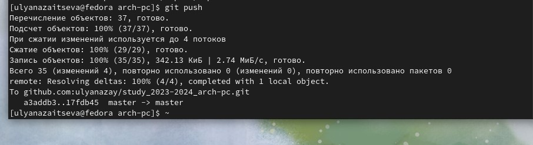

---
## Front matter
title: "Отчет по лабораторной работе № 2"
subtitle: "Дисциплина: Архитектура компьютера"
author: "Зайцева Ульяна Владимировна"

## Generic otions
lang: ru-RU
toc-title: "Содержание"

## Bibliography
bibliography: bib/cite.bib
csl: pandoc/csl/gost-r-7-0-5-2008-numeric.csl

## Pdf output format
toc: true # Table of contents
toc-depth: 2
lof: true # List of figures
lot: true # List of tables
fontsize: 12pt
linestretch: 1.5
papersize: a4
documentclass: scrreprt
## I18n polyglossia
polyglossia-lang:
  name: russian
  options:
	- spelling=modern
	- babelshorthands=true
polyglossia-otherlangs:
  name: english
## I18n babel
babel-lang: russian
babel-otherlangs: english
## Fonts
mainfont: PT Serif
romanfont: PT Serif
sansfont: PT Sans
monofont: PT Mono
mainfontoptions: Ligatures=TeX
romanfontoptions: Ligatures=TeX
sansfontoptions: Ligatures=TeX,Scale=MatchLowercase
monofontoptions: Scale=MatchLowercase,Scale=0.9
## Biblatex
biblatex: true
biblio-style: "gost-numeric"
biblatexoptions:
  - parentracker=true
  - backend=biber
  - hyperref=auto
  - language=auto
  - autolang=other*
  - citestyle=gost-numeric
## Pandoc-crossref LaTeX customization
figureTitle: "Рис."
tableTitle: "Таблица"
listingTitle: "Листинг"
lofTitle: "Список иллюстраций"
lotTitle: "Список таблиц"
lolTitle: "Листинги"
## Misc options
indent: true
header-includes:
  - \usepackage{indentfirst}
  - \usepackage{float} # keep figures where there are in the text
  - \floatplacement{figure}{H} # keep figures where there are in the text
---

# Цель работы

Изучение идеологии и применения средств контроля версий. Приобрести практические навыки по работе с системой git.

# Задание

1. Настройка GitHub.
2. Базовая настройка Git.
3. Создание SSH-ключа.
4. Создание рабочего пространства и репозитория курса на основе шаблона.
5. Создание репозитория курса на основе шаблона.
6. Настройка каталога курса.
7. Выполнение заданий для самостоятельной работы.

# Теоретическое введение

Системы контроля версий (Version Control System, VCS) применяются при работе
нескольких человек над одним проектом. Обычно основное дерево проекта хранится в локальном или удалённом репозитории, к которому настроен доступ для участников проекта. При внесении изменений в содержание проекта система контроля версий позволяет их фиксировать, совмещать изменения, произведённые разными участниками проекта, производить откат к любой более ранней версии проекта, если это требуется. 
	В классических системах контроля версий используется централизованная модель, предполагающая наличие единого репозитория для хранения файлов. Выполнение большинства функций по управлению версиями осуществляется специальным сервером. Участник проекта (пользователь) перед началом работы посредством определённых команд получает нужную ему версию файлов. После внесения изменений, пользователь размещает новую версию в хранилище. При этом предыдущие версии не удаляются из центрального хранилища и к ним можно вернуться в любой момент. Сервер может сохранять не полную версию изменённых файлов, а производить так называемую дельта-компрессию — сохранять только изменения между последовательными версиями, что позволяет уменьшить объём хранимых данных.
	Системы контроля версий поддерживают возможность отслеживания и разрешения конфликтов, которые могут возникнуть при работе нескольких человек над одним файлом.
	Можно объединить (слить) изменения, сделанные разными участниками (автоматически или вручную), вручную выбрать нужную версию, отменить изменения вовсе или заблокировать файлы для изменения. В зависимости от настроек блокировка не позволяет другим пользователям получить рабочую копию или препятствует изменению рабочей копии файла средствами файловой системы ОС, обеспечивая таким образом, привилегированный доступ только одному  пользователю, работающему с файлом.
	Системы контроля версий также могут обеспечивать дополнительные, более гибкие функциональные возможности. Например, они могут поддерживать работу с несколькими версиями одного файла, сохраняя общую историю изменений до точки ветвления версий и собственные истории изменений каждой ветви. Кроме того, обычно доступна информация о том, кто из участников, когда и какие изменения вносил. Обычно такого рода информация хранится в журнале изменений, доступ к которому можно ограничить.
	В отличие от классических, в распределённых системах контроля версий центральный репозиторий не является обязательным. Среди классических VCS наиболее известны CVS, Subversion, а среди распределённых —
Git, Bazaar, Mercurial. Принципы их работы схожи, отличаются они в основном синтаксисом используемых в работе команд. 

# Выполнение лабораторной работы

#1 . Настройка GitHub

Cоздаю учётную записать на github и заполняю основные данные(рис. @fig:001).

{#fig:001 width=70%}

# 2. Базовая настройка Git.

Открываю терминал и ввожу команды, указывая своё имя и email. Настраиваю utf-8(рис. @fig:002)

{#fig:002 width=70%}

Задаю имя начальной ветки(master), использую параметры autocrlf и safecrlf(рис. @fig:003)

. Для этого ввожу команду ssh-keygen -C “Имя Фамилия, work@email”, указывая имя владельца и электронную почту владельца. (рис. @fig:004)

{#fig:004 width=70%}

Xclip – утилита, которая позволяет скопировать любой текст через терминал. Устанавливаю необходимый пакет для данной утилиты уже при попытке её использовать. После установки заново пишу команду и копирую содержимое файла(сгенерированный ssh-ключ)(рис. @fig:005)

{#fig:005 width=70%}

Вставляю скопированный ключ в поле Key, задаю имя ключу в поле Title(рис. @fig:006)

{#fig:006 width=70%}

# 4. Создание рабочего пространства и репозитория курса на основе шаблона.
 
Возвращаюсь в терминал и создаю рабочее пространство “Архитектура компьютера” c помощью команды mkdir. С помощью команды ls проверяю выполнение команды(рис. @fig:007)

{#fig:007 width=70%}

# 5. Создание репозитория курса на основе шаблона.

В браузере перехожу на страницу репозитория с шаблоном курса https://github.com/yamadharma/course-directory-student-template. Выбираю «Use this template», чтобы использовать шаблон для своего репозитория(рис. @fig:008)

{#fig:008 width=70%}

Задаю имя репозитория study_2023–2024_arсh-pc и создаю репозиторий (кнопка Create repository)(рис. @fig:009)

{#fig:009 width=70%}

Репозиторий создан!(рис. @fig:010)

{#fig:010 width=70%}

Открываю терминал и перехожу в каталог курса: cd ~/work/study/2023-2024/"Архитектура компьютера"(плохо обрезала скрин и данная команда в него не попала, но по полю перед знаком $ как раз указан каталог в котором я нахожусь, а именно каталог “Архитектура компьютера”, в который я и перешла до клонирования прописав данную команду!). Клонирую созданный репозиторий.(рис. @fig:011)

{#fig:011 width=70%}

# 6. Настройка каталога курса.

Перехожу в каталог курса с помощью команды cd, удаляю лишние файлы с помощью команды rm, создаю необходимые каталоги, добавляю их и сохраняю изменения на сервере(рис. @fig:012)

{#fig:012 width=70%}

Отправляю созданные каталоги на сервер(рис. @fig:013)

{#fig:013 width=70%}

Проверяю правильность выполнения работы на сайте GitHub (рис. @fig:014).

{#fig:014 width=70%}

# 7. Выполнение заданий для самостоятельной работы.

Загружаю отчёт по первой лабораторной работе в нужный каталог, а именно lab01/report, используя сайт(рис. @fig:014)

{#fig:015 width=70%}

Когда завершу данный отчёт, загружу его в каталог lab02/report!

# Выводы

При выполнении данной лабораторной работы я изучила идеологию и применение средств контроля версий, а также приобрела практические навыки по работе с системой git.

