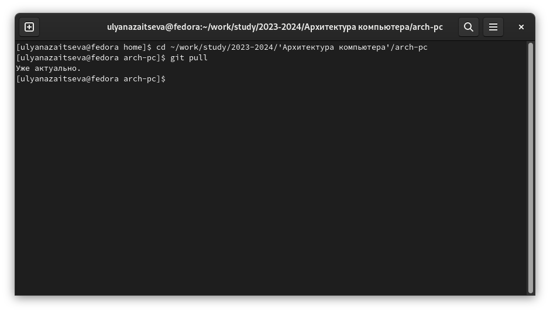
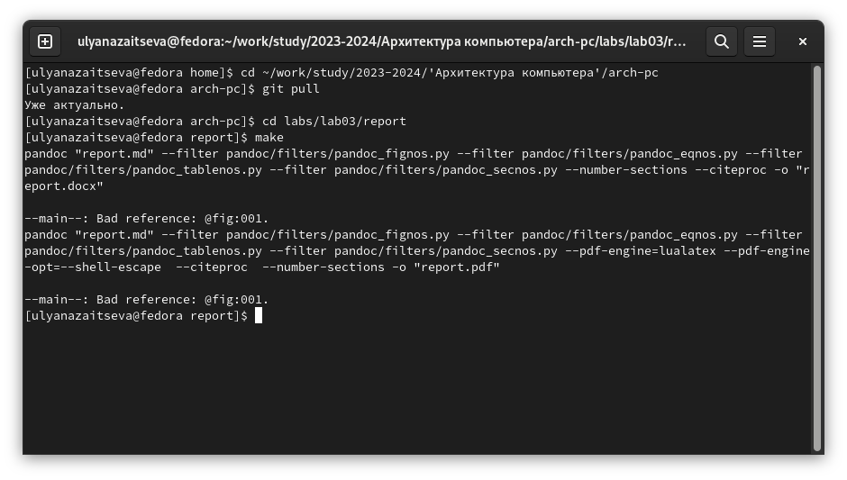
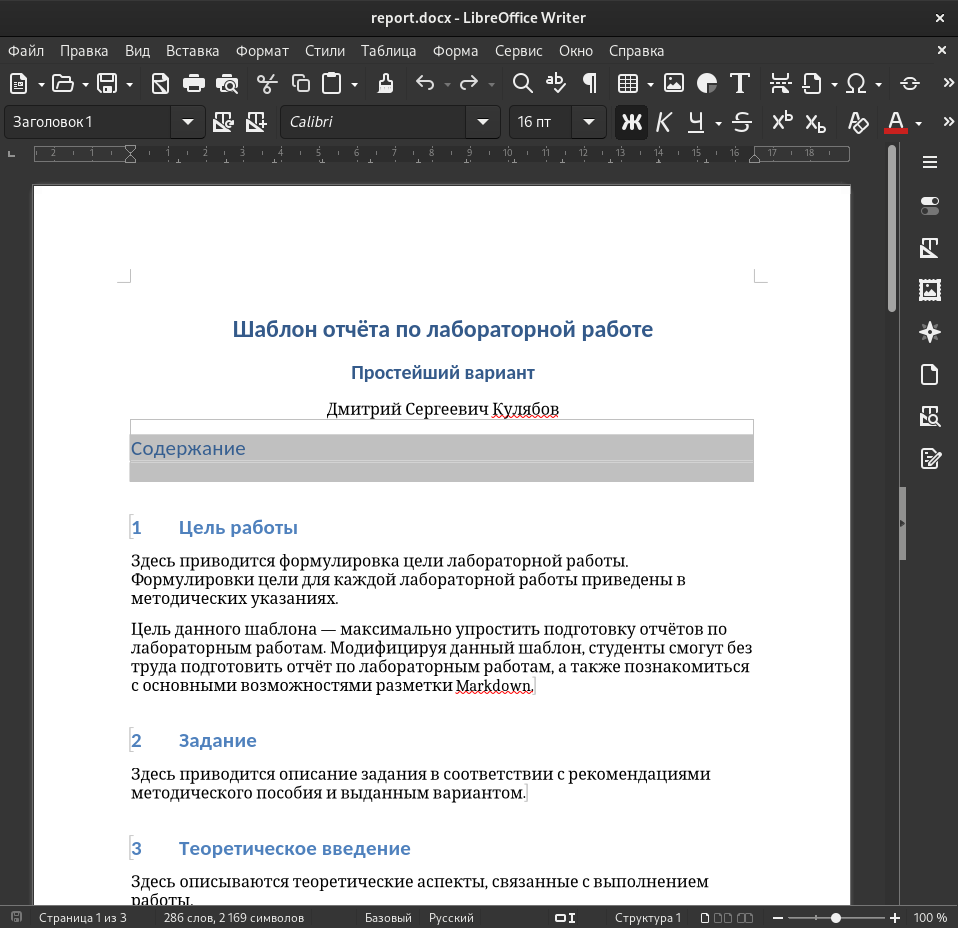
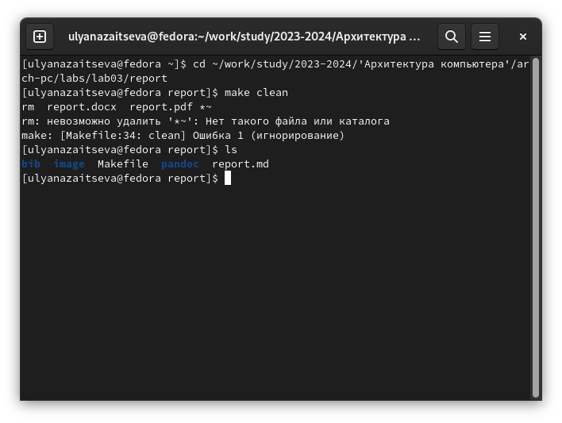
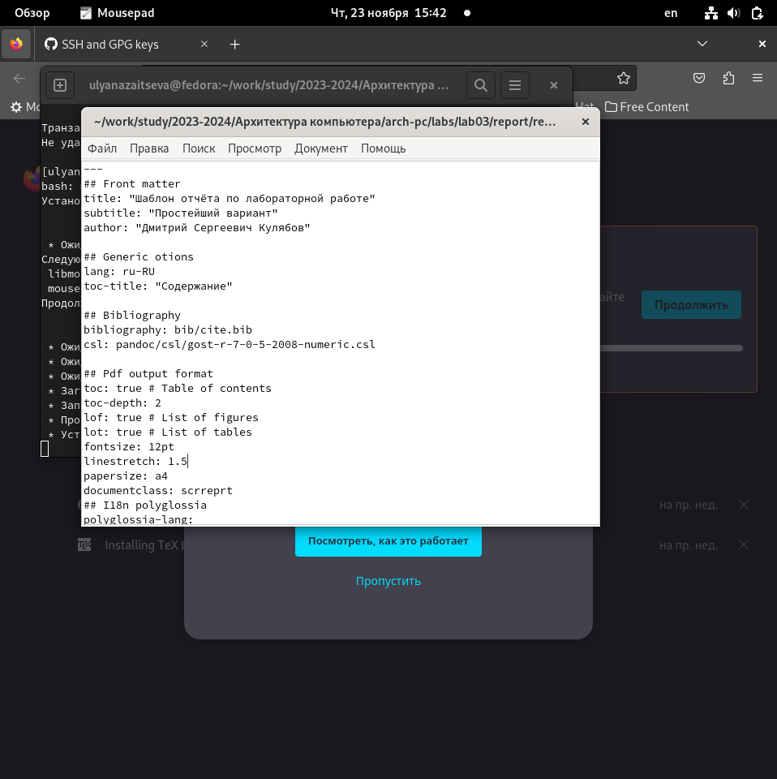
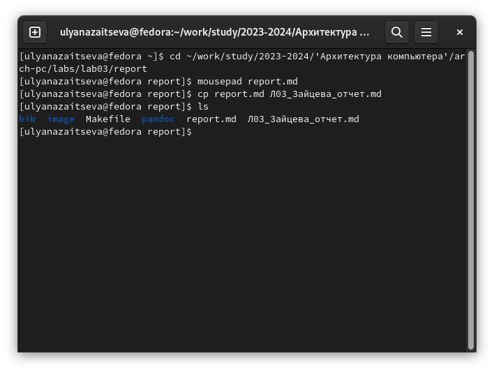
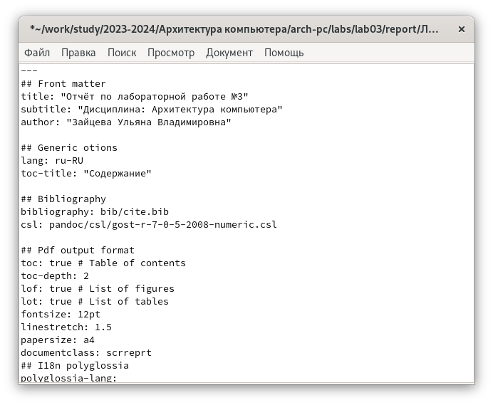
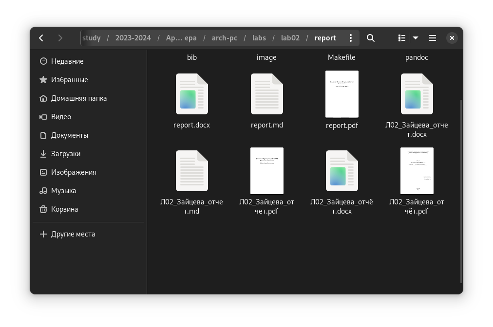
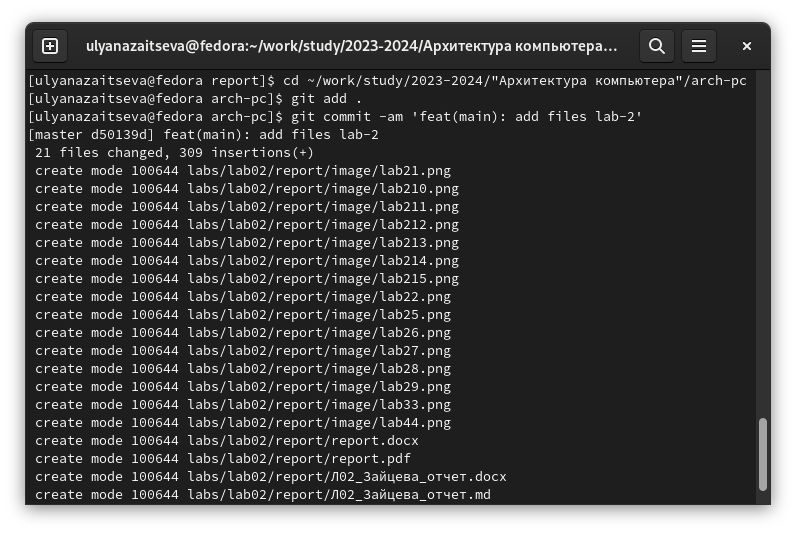

---
## Front matter
title: "Отчёт по лабораторной работе №3"
subtitle: "Дисциплина: Архитектура компьютера"
author: "Зайцева Ульяна Владимировна"

## Generic otions
lang: ru-RU
toc-title: "Содержание"

## Bibliography
bibliography: bib/cite.bib
csl: pandoc/csl/gost-r-7-0-5-2008-numeric.csl

## Pdf output format
toc: true # Table of contents
toc-depth: 2
lof: true # List of figures
lot: true # List of tables
fontsize: 12pt
linestretch: 1.5
papersize: a4
documentclass: scrreprt
## I18n polyglossia
polyglossia-lang:
  name: russian
  options:
	- spelling=modern
	- babelshorthands=true
polyglossia-otherlangs:
  name: english
## I18n babel
babel-lang: russian
babel-otherlangs: english
## Fonts
mainfont: PT Serif
romanfont: PT Serif
sansfont: PT Sans
monofont: PT Mono
mainfontoptions: Ligatures=TeX
romanfontoptions: Ligatures=TeX
sansfontoptions: Ligatures=TeX,Scale=MatchLowercase
monofontoptions: Scale=MatchLowercase,Scale=0.9
## Biblatex
biblatex: true
biblio-style: "gost-numeric"
biblatexoptions:
  - parentracker=true
  - backend=biber
  - hyperref=auto
  - language=auto
  - autolang=other*
  - citestyle=gost-numeric
## Pandoc-crossref LaTeX customization
figureTitle: "Рис."
tableTitle: "Таблица"
listingTitle: "Листинг"
lofTitle: "Список иллюстраций"
lotTitle: "Список таблиц"
lolTitle: "Листинги"
## Misc options
indent: true
header-includes:
  - \usepackage{indentfirst}
  - \usepackage{float} # keep figures where there are in the text
  - \floatplacement{figure}{H} # keep figures where there are in the text
---

# Цель работы

Целью данной лабораторной работы является освоение процедуры оформления отчетов с помощью легковесного языка разметки Markdown.

# Задание

1. Обновление локального репозитория
2. Компиляция шаблона
3. Заполнение отчета по лабораторной работе
4. Задание для самостоятельной работы

## Теоретическое введение

Markdown - легковесный язык разметки, созданный с целью обозначения форматирования в простом тексте, с максимальным сохранением его читаемости человеком, и пригодный для машинного преобразования в языки для продвинутых публикаций. Внутритекстовые формулы делаются аналогично формулам LaTeX. В Markdown вставить изображение в документ можно с помощью непосредственного указания адреса изображения. Синтаксис Markdown для встроенной ссылки состоит из части [link text], представляющей текст гиперссылки, и части (file-name.md) – URL-адреса или имени файла, на который дается ссылка. Markdown поддерживает как встраивание фрагментов кода в предложение, так и их размещение между предложениями в виде отдельных огражденных блоков. Огражденные блоки кода — это простой способ выделить синтаксис для фрагментов кода.

## Выполнение лабораторной работы

# Обновление локального репозитория

Открываю терминал. Перехожу в каталог курса, сформированный при выполнении прошлой лаборатной работы. Обновляю локальный репозиторий, скачав изменения из удаленного репозитория с помощью команды git pull
(рис. @fig:001).

{#fig:001 width=70%}

# Компиляция шаблона

Перехожу в каталог с шаблоном отчета по лабораторной работе №3 и провожу компиляцию шаблона с использованием Makefile и команды make(рис. @fig:002).

{#fig:002 width=70%}

Для проверки открываю сгенерированный файл report.docx в LibreOffice (рис. @fig:003). Аналогично проверяю report.pdf

{#fig:003 width=70%}

Удаляю полученные файлы вводя команду make clean (рис. @fig:004). С помощью команды ls проверяю, удалились ли созданные файлы.

{#fig:004 width=70%}

Открываю файл report.md с помощью любого текстового редактора mousepad(рис. @fig:005)

{#fig:005 width=70%}

Для удобства копирую файл report.md уже с другим названием(рис. @fig:006)

{#fig:006 width=70%}

# Заполнение отчета по лабораторной работе

С помощью текстового редактора открываю файл Л03_Зайцева_отчет.md и начинаю заполнять отчет. (рис. @fig:007).

{#fig:007 width=70%}

# Задание для самостоятельной работы

В соответствующем каталоге делаю отчёт по лабораторной работе №2 в формате .md, компилирую в .pdf и .docx(рис. @fig:008)

{#fig:008 width=70%}

Загружаю файлы на Github. (рис. @fig:009)

{#fig:009 width=70%}

# Выводы

В результате выполнения данной лабораторной работы я освоила процедуры оформления отчетов с помощью легковесного языка разметки Markdown.
