---
## Front matter
title: "Отчёт по лабораторной работе №4"
subtitle: "Дисциплина:Архитектура компьютера"
author: "Зайцева Ульяна Владимировна"

## Generic otions
lang: ru-RU
toc-title: "Содержание"

## Bibliography
bibliography: bib/cite.bib
csl: pandoc/csl/gost-r-7-0-5-2008-numeric.csl

## Pdf output format
toc: true # Table of contents
toc-depth: 2
lof: true # List of figures
lot: true # List of tables
fontsize: 12pt
linestretch: 1.5
papersize: a4
documentclass: scrreprt
## I18n polyglossia
polyglossia-lang:
  name: russian
  options:
	- spelling=modern
	- babelshorthands=true
polyglossia-otherlangs:
  name: english
## I18n babel
babel-lang: russian
babel-otherlangs: english
## Fonts
mainfont: PT Serif
romanfont: PT Serif
sansfont: PT Sans
monofont: PT Mono
mainfontoptions: Ligatures=TeX
romanfontoptions: Ligatures=TeX
sansfontoptions: Ligatures=TeX,Scale=MatchLowercase
monofontoptions: Scale=MatchLowercase,Scale=0.9
## Biblatex
biblatex: true
biblio-style: "gost-numeric"
biblatexoptions:
  - parentracker=true
  - backend=biber
  - hyperref=auto
  - language=auto
  - autolang=other*
  - citestyle=gost-numeric
## Pandoc-crossref LaTeX customization
figureTitle: "Рис."
tableTitle: "Таблица"
listingTitle: "Листинг"
lofTitle: "Список иллюстраций"
lotTitle: "Список таблиц"
lolTitle: "Листинги"
## Misc options
indent: true
header-includes:
  - \usepackage{indentfirst}
  - \usepackage{float} # keep figures where there are in the text
  - \floatplacement{figure}{H} # keep figures where there are in the text
---

# Цель работы

Освоение процедуры компиляции и сборки программ, написанных на ассемблере NASM

# Задание

1. Программа Hello world!
2. Транслятор NASM
3. Расширенный синтаксис командной строки NASM
4. Компоновщик LD
5. Запуск исполняемого файла
6. Задание для самостоятельной работы

# Теоретическое введение

Основными функциональными элементами любой электронно-вычислительной машины
(ЭВМ) являются центральный процессор, память и периферийные устройства (рис. 4.1).
Взаимодействие этих устройств осуществляется через общую шину, к которой они подключены. Физически шина представляет собой большое количество проводников, соединяющих устройства друг с другом. В современных компьютерах проводники выполнены в виде электропроводящих дорожек на материнской (системной) плате.
Основной задачей процессора является обработка информации, а также организация
координации всех узлов компьютера. В состав центрального процессора (ЦП) входят
следующие устройства:
• арифметико-логическое устройство (АЛУ) — выполняет логические и арифметические действия, необходимые для обработки информации, хранящейся в памяти;
• устройство управления (УУ) — обеспечивает управление и контроль всех устройств
компьютера;
• регистры — сверхбыстрая оперативная память небольшого объёма, входящая в состав процессора, для временного хранения промежуточных результатов выполнения
инструкций; регистры процессора делятся на два типа: регистры общего назначения и
специальные регистры.

Доступ к регистрам осуществляется не по адресам, как к основной памяти, а по именам.
Каждый регистр процессора архитектуры x86 имеет свое название, состоящее из 2 или 3
букв латинского алфавита.
В качестве примера приведем названия основных регистров общего назначения (именно
эти регистры чаще всего используются при написании программ):
• RAX, RCX, RDX, RBX, RSI, RDI — 64-битные
• EAX, ECX, EDX, EBX, ESI, EDI — 32-битные
• AX, CX, DX, BX, SI, DI — 16-битные
• AH, AL, CH, CL, DH, DL, BH, BL — 8-битные (половинки 16-битных регистров). Например,
AH (high AX) — старшие 8 бит регистра AX, AL (low AX) — младшие 8 бит регистра AX.

Язык ассемблера (assembly language, сокращённо asm) — машинно-ориентированный
язык низкого уровня. Можно считать, что он больше любых других языков приближен к
архитектуре ЭВМ и её аппаратным возможностям, что позволяет получить к ним более
полный доступ, нежели в языках высокого уровня, таких как C/C++, Perl, Python и пр.
Следует отметить, что процессор понимает не команды ассемблера, а последовательности
из нулей и единиц — машинные коды.

# Выполнение лабораторной работы

1. Программа Hello world!

Создаю каталог для работы с программами на языке ассемблера NASM и перехожу в созданный каталог.(рис. @fig:001)

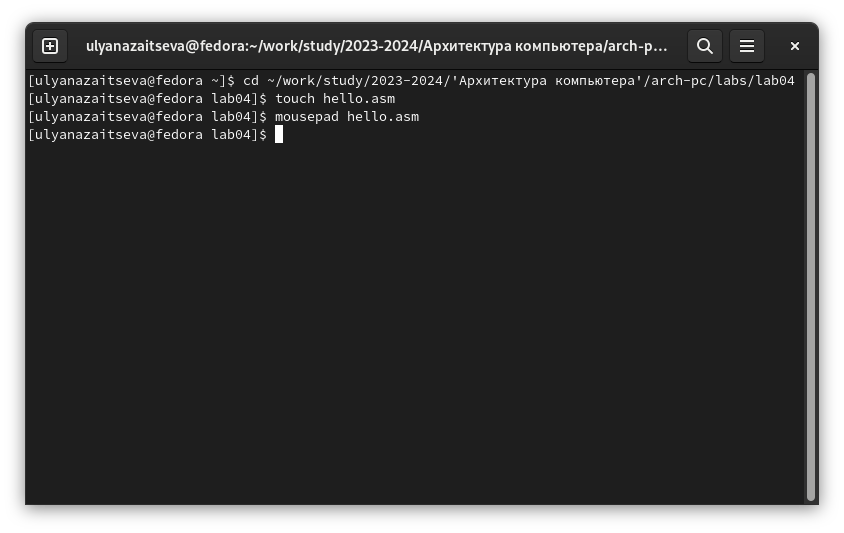{#fig:001 width=70%}

Создаю текстовый файл с именем hello.asm, открываю этот файл с помощью текстового редактора и ввожу следующий текст из файла.(рис. @fig:002)

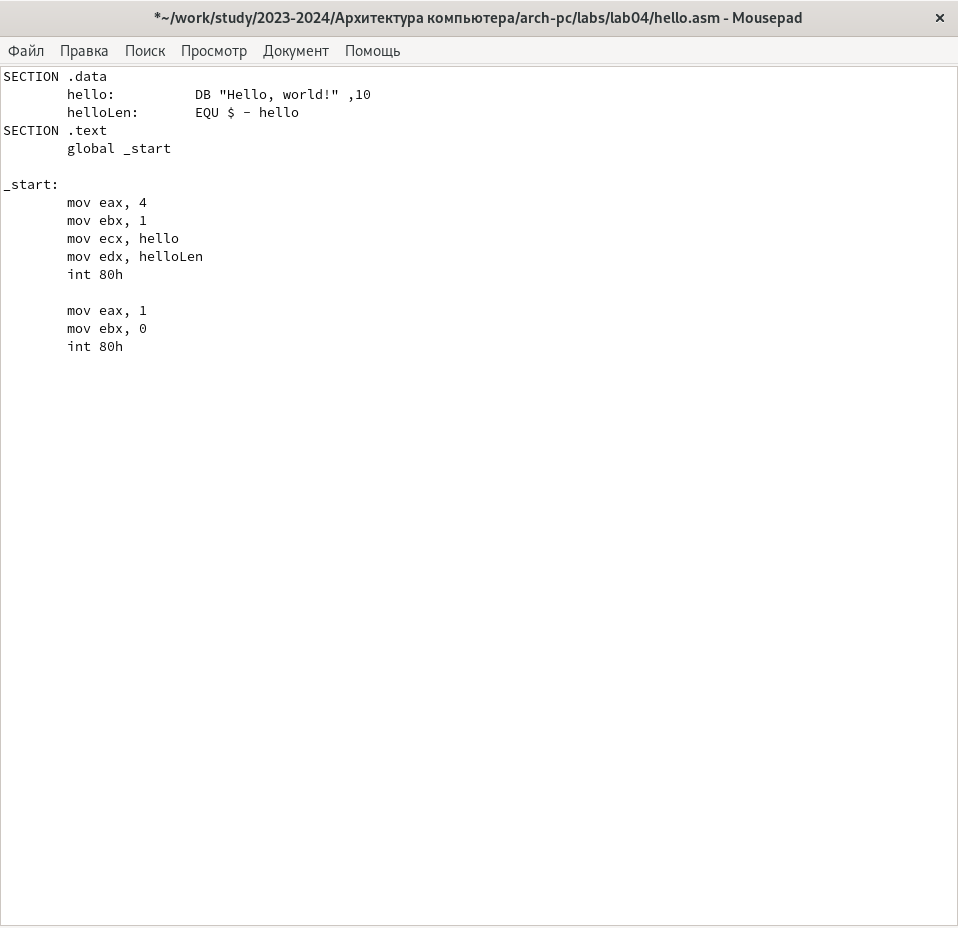{#fig:002 width=70%}

2. Транслятор NASM

Компилирую программу с помощи команды nasm -f elf hello.asm и проверим, что файл создан.(рис. @fig:003)

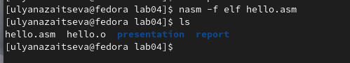{#fig:003 width=70%}

3. Расширенный синтаксис командной строки NASM

С помощью команды nasm -o obj.o -f elf -g -l list.lst hello.asm компилирую исходный файл hello.asm в obj.o, проверяю, что файл создан.(рис. @fig:004)

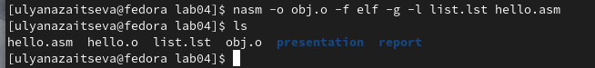{#fig:004 width=70%}

4. Компоновщик LD

Передаю объектный файл на обработку компоновщику с помощью команды ld -m elf_i386 hello.o -o hello и проверяю, что исполняемый файл hello был создан.(рис. @fig:005)

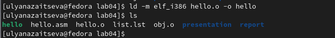{#fig:005 width=70%}

Создаю ещё один файл с помощью команды ld -m elf_i386 obj.o -o main.(рис. @fig:006)

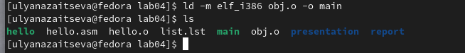{#fig:006 width=70%}

5. Запуск исполняемого файла

Запускаю созданный исполняемый файл с помощью команды ./hello.(рис. @fig:007)

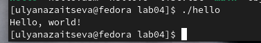{#fig:007 width=70%}

6. Задание для самостоятельной работы

В каталоге ~/work/arch-pc/'Архитектура компьютера'/arch-pc/labs/lab04 создаю копию файла hello.asm с именем lab4.asm с помощью команды cp(рис. @fig:008)

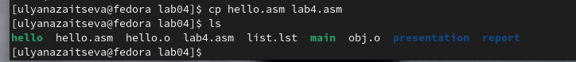{#fig:008 width=70%}

С помощью текстового редактора вношу изменения в текст программы в файле lab4.asm так, чтобы вместо Hello world! на экран выводилась строка с моими фамилией и именем.(рис. @fig:009)

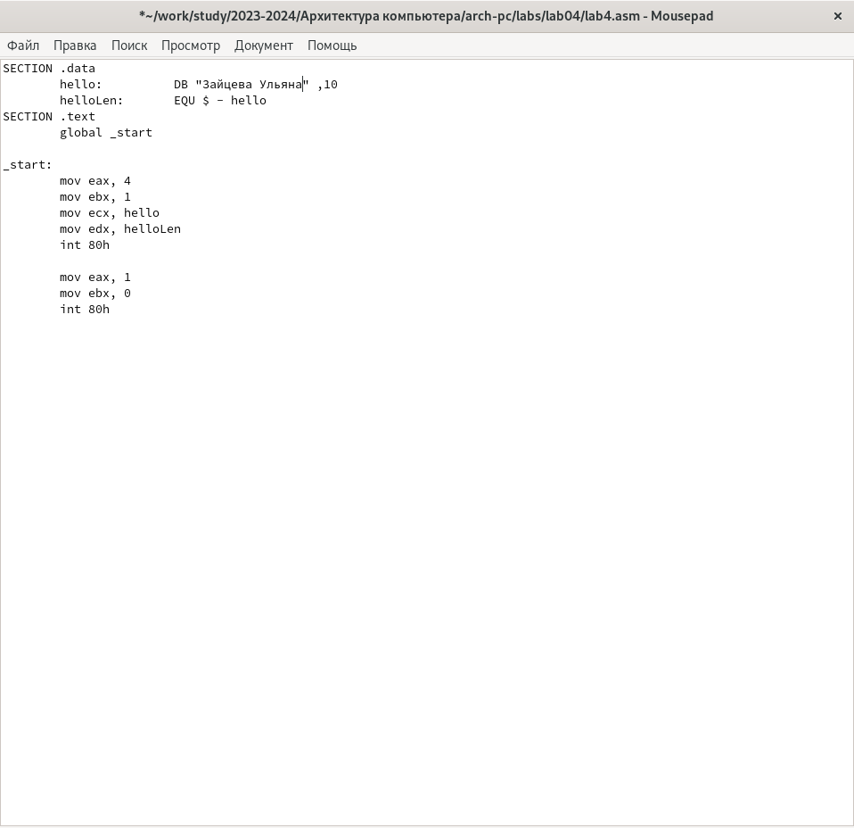{#fig:009 width=70%}

Компилирую полученный текст программы lab4.asm в объектный файл. Выполняю компоновку объектного файла и запускаю получившийся исполняемый файл.(рис. @fig:010)

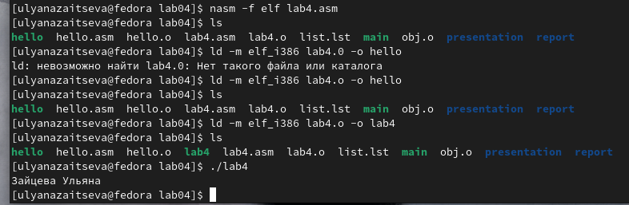{#fig:010 width=70%}

Проверяю что файлы находятся в нужном каталоге и загружаю на Гитхаб(рис. @fig:011)

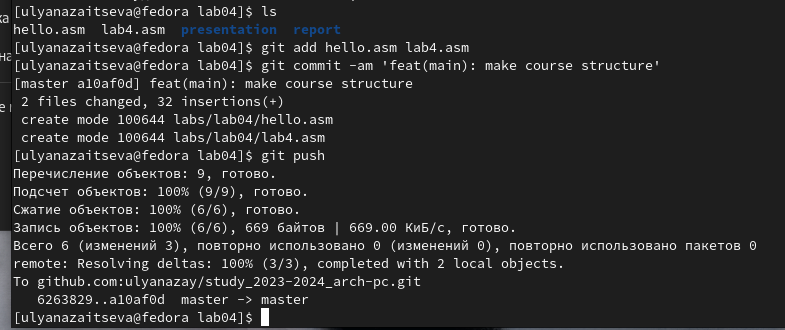{#fig:011 width=70%}

# Выводы

В ходе выполнения лабораторной работы я освоила процедуры компиляции и сборки программ, написанных на ассемблере NASM

