---
## Front matter
title: "Отчёт по лабораторной работе №5"
subtitle: "Дисциплина: Архитектура компьютера"
author: "Зайцева Ульяна Владимировна"

## Generic otions
lang: ru-RU
toc-title: "Содержание"

## Bibliography
bibliography: bib/cite.bib
csl: pandoc/csl/gost-r-7-0-5-2008-numeric.csl

## Pdf output format
toc: true # Table of contents
toc-depth: 2
lof: true # List of figures
lot: true # List of tables
fontsize: 12pt
linestretch: 1.5
papersize: a4
documentclass: scrreprt
## I18n polyglossia
polyglossia-lang:
  name: russian
  options:
	- spelling=modern
	- babelshorthands=true
polyglossia-otherlangs:
  name: english
## I18n babel
babel-lang: russian
babel-otherlangs: english
## Fonts
mainfont: PT Serif
romanfont: PT Serif
sansfont: PT Sans
monofont: PT Mono
mainfontoptions: Ligatures=TeX
romanfontoptions: Ligatures=TeX
sansfontoptions: Ligatures=TeX,Scale=MatchLowercase
monofontoptions: Scale=MatchLowercase,Scale=0.9
## Biblatex
biblatex: true
biblio-style: "gost-numeric"
biblatexoptions:
  - parentracker=true
  - backend=biber
  - hyperref=auto
  - language=auto
  - autolang=other*
  - citestyle=gost-numeric
## Pandoc-crossref LaTeX customization
figureTitle: "Рис."
tableTitle: "Таблица"
listingTitle: "Листинг"
lofTitle: "Список иллюстраций"
lotTitle: "Список таблиц"
lolTitle: "Листинги"
## Misc options
indent: true
header-includes:
  - \usepackage{indentfirst}
  - \usepackage{float} # keep figures where there are in the text
  - \floatplacement{figure}{H} # keep figures where there are in the text
---

# Цель работы

Приобретение практических навыков работы в Midnight Commander. Освоение инструкций
языка ассемблера mov и int.

# Задание

1. Начало работы с Midnight Commander.
2. Подключение внешнего файла in_out.asm.
3. Задания для самостоятельной работы.

# Теоретическое введение

Midnight Commander (или просто mc) — это программа, которая позволяет просматривать
структуру каталогов и выполнять основные операции по управлению файловой системой,
т.е. mc является файловым менеджером. Midnight Commander позволяет сделать работу с
файлами более удобной и наглядной.
Для активации оболочки Midnight Commander достаточно ввести в командной строке mc и нажать клавишу Enter..
В Midnight Commander используются функциональные клавиши F1 — F10 , к которым
привязаны часто выполняемые операции.

Программа на языке ассемблера NASM, как правило, состоит из трёх секций: секция кода
программы (SECTION .text), секция инициированных (известных во время компиляции)
данных (SECTION .data) и секция неинициализированных данных (тех, под которые во
время компиляции только отводится память, а значение присваивается в ходе выполнения
программы) (SECTION .bss).

# Выполнение лабораторной работы

1. Начало работы с Midnight Commander.

Открываю Midnight Commander с помощью команды mc.(рис. @fig:001).

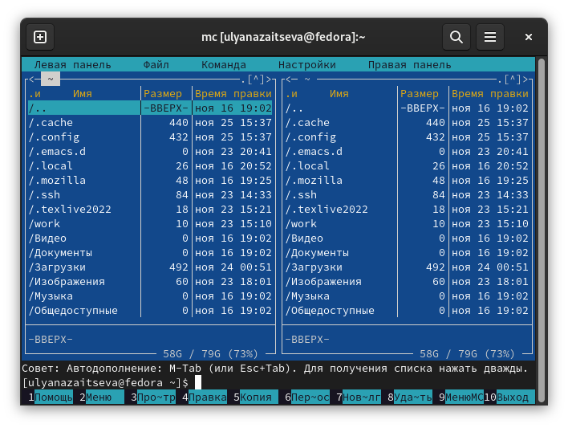{#fig:001 width=70%}

Пользуясь клавишами вверх, вниз и Enter перехожу в каталог, созданный при выполнении лабораторной работы №4, с помощью функциональной клавиши F7 создаю папку lab05 и перехожу в созданный каталог.(рис. @fig:002).

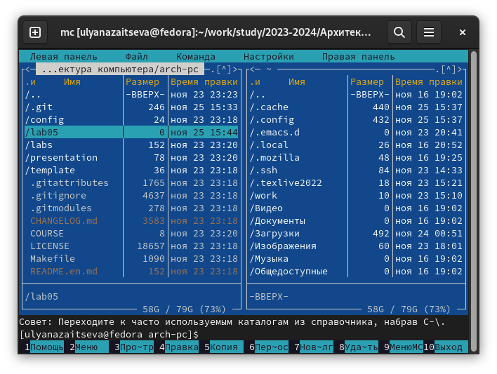{#fig:002 width=70%}

Пользуясь строкой ввода и командой touch создаю файл lab5-1.asm.
С помощью функциональной клавиши F4 открываю файл lab5-1.asm для редактирования во встроенном редакторе, ввожу текст программы из листинга 5.1, сохраняю изменения с помощью функциональной клавиши F2 и закрываю файл.(рис. @fig:003)

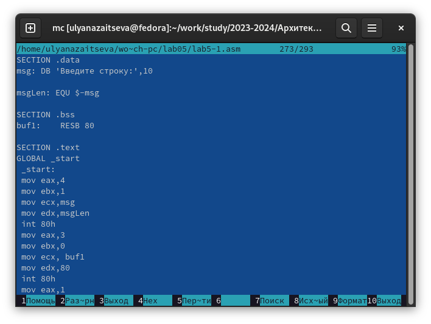{#fig:003 width=70%}

Компилирую текст программы lab5-1.asm в объектный файл, выполняю компоновку объектного файла и запускаю получившийся исполняемый файл, в строку ввожу моё ФИО.(рис. @fig:004).

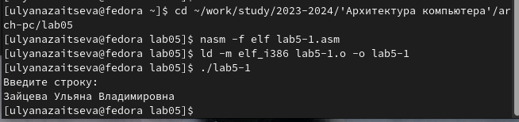{#fig:004 width=70%}

2. Подключение внешнего файла in_out.asm.

Скачиваю файл in_out.asm со страницы в ТУИС.(рис. @fig:005).

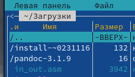{#fig:005 width=70%}

Копирую файл in_out.asm в каталог с файлом lab5-1.asm с помощью функциональной клавиши F5.(рис. @fig:006).

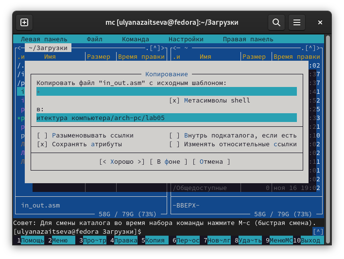{#fig:006 width=70%}

С помощью функциональной клавиши F6 создаю копию файла lab5-1.asm с именем lab5-2.asm.(рис. @fig:007)

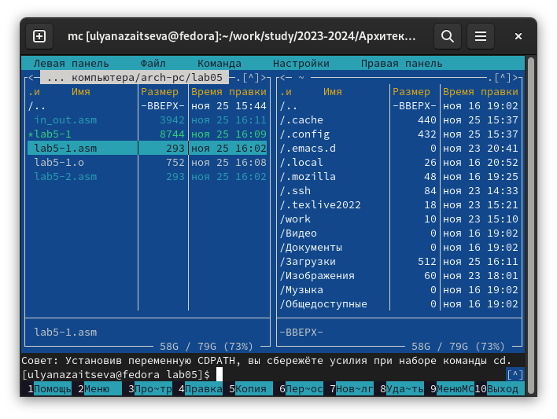{#fig:007 width=70%}

Исправляю текст программы в файле lab5-2.asm с использование подпрограмм из внешнего файла in_out.asm в соответствии с листингом 5.2.(рис. @fig:008)

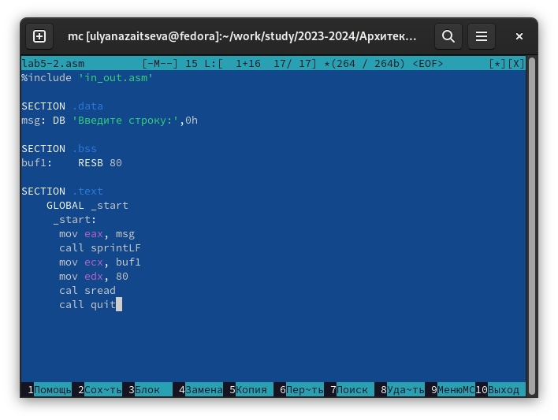{#fig:008 width=70%}

Не знаю где потерялся скрин:(( Я создаю исполняемый файл и проверяю его работу. Вывод получается  как на
(рис. @fig:004).

Затем в файле lab5-2.asm заменяю подпрограмму sprintLF на sprint.(рис. @fig:009)

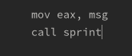{#fig:009 width=70%}

Создаю исполняемый файл и проверяю его работу.(рис. @fig:010).

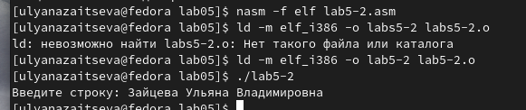{#fig:010 width=70%}

Разница в том, что в первой программе ввод текста происходил с новой строки, в новой программе перехода на новую строку нет.

3. Задания для самостоятельной работы.

Создаю копию файла lab5-1.asm с именем lab5-1-1.asm. Вношу изменения в программу так, чтобы она выводила введённую строку на экран.(рис. @fig:011)

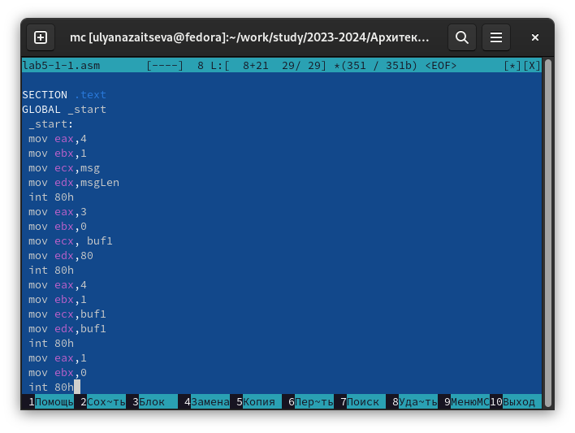{#fig:011 width=70%}

Код:

SECTION .data
msg: DB 'Введите строку:',10

msgLen: EQU $-msg

SECTION .bss
buf1:    RESB 80

SECTION .text
GLOBAL _start
 _start:
 mov eax,4
 mov ebx,1
 mov ecx,msg
 mov edx,msgLen
 int 80h
 mov eax,3
 mov ebx,0
 mov ecx, buf1
 mov edx,80
 int 80h
 mov eax,4
 mov ebx,1
 mov ecx,buf1
 mov edx,buf1
 int 80h
 mov eax,1
 mov ebx,0
 int 80h

Компилирую файл и проверяю его работу. Ввожу своё ФИО.(рис. @fig:012)

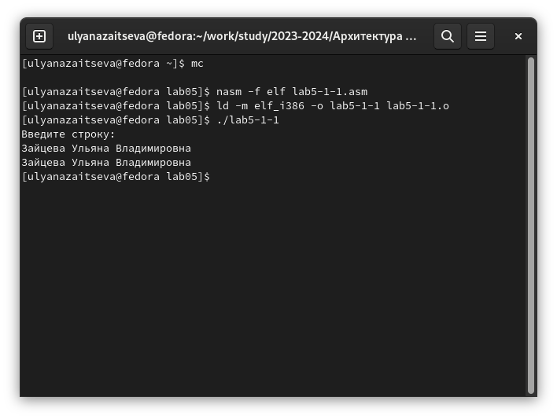{#fig:012 width=70%}

Создаю копию файла lab5-2.asm с названием lab5-2-1.asm(рис. @fig:013)

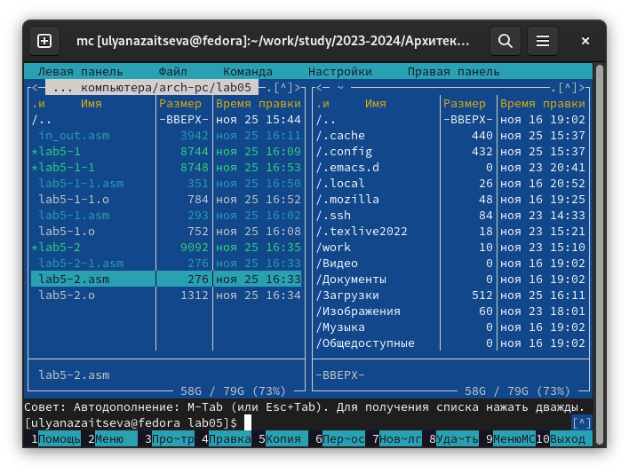{#fig:013 width=70%}

Вношу изменения в программу с использование подпрограмм из внешнего файла in_out.asm так, чтобы она выводила введённую строку на экран.(рис. @fig:014)

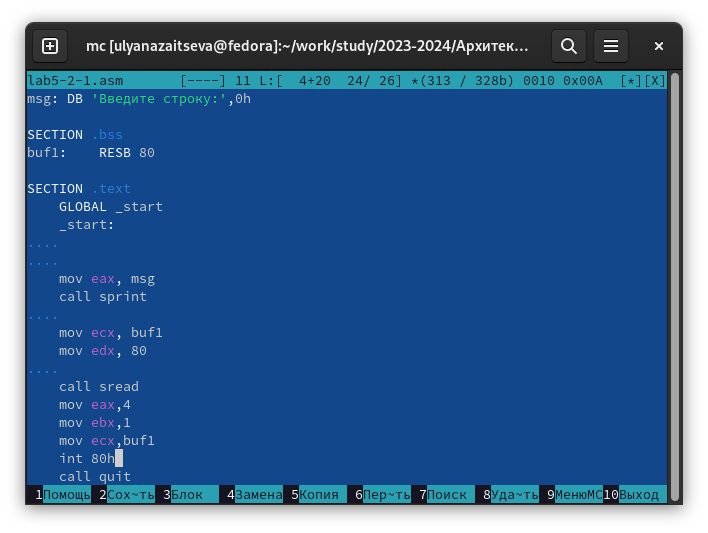{#fig:014 width=70%}

Код:

%include 'in_out.asm'

SECTION .data
msg: DB 'Введите строку:',0h

SECTION .bss
buf1:    RESB 80

SECTION .text
    GLOBAL _start
    _start:
    
    
    mov eax, msg
    call sprint
    
    mov ecx, buf1
    mov edx, 80
    
    call sread
    mov eax,4
    mov ebx,1
    mov ecx,buf1
    int 80h
    call quit

Создаю исполняемый файл и проверяю его работу.(рис. @fig:015)

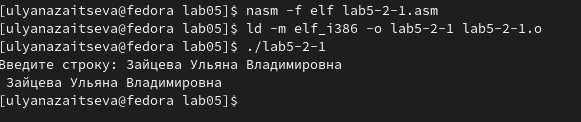{#fig:015 width=70%}

Случайно поставила пробел, поэтому и он появился
# Выводы

Во время выполнения лабораторной работы я приобрела навыки работы в Midnight Commander и освоила инструкции языка ассемблер mov и int.

