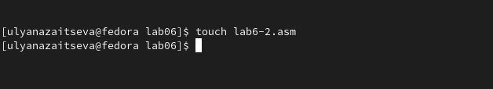

---
## Front matter
title: "Отчёт по лабораторной работе №6"
subtitle: "Дисциплина: архитектура компьютеров"
author: "Зайцева Ульяна Владимировна"

## Generic otions
lang: ru-RU
toc-title: "Содержание"

## Bibliography
bibliography: bib/cite.bib
csl: pandoc/csl/gost-r-7-0-5-2008-numeric.csl

## Pdf output format
toc: true # Table of contents
toc-depth: 2
lof: true # List of figures
lot: true # List of tables
fontsize: 12pt
linestretch: 1.5
papersize: a4
documentclass: scrreprt
## I18n polyglossia
polyglossia-lang:
  name: russian
  options:
	- spelling=modern
	- babelshorthands=true
polyglossia-otherlangs:
  name: english
## I18n babel
babel-lang: russian
babel-otherlangs: english
## Fonts
mainfont: PT Serif
romanfont: PT Serif
sansfont: PT Sans
monofont: PT Mono
mainfontoptions: Ligatures=TeX
romanfontoptions: Ligatures=TeX
sansfontoptions: Ligatures=TeX,Scale=MatchLowercase
monofontoptions: Scale=MatchLowercase,Scale=0.9
## Biblatex
biblatex: true
biblio-style: "gost-numeric"
biblatexoptions:
  - parentracker=true
  - backend=biber
  - hyperref=auto
  - language=auto
  - autolang=other*
  - citestyle=gost-numeric
## Pandoc-crossref LaTeX customization
figureTitle: "Рис."
tableTitle: "Таблица"
listingTitle: "Листинг"
lofTitle: "Список иллюстраций"
lotTitle: "Список таблиц"
lolTitle: "Листинги"
## Misc options
indent: true
header-includes:
  - \usepackage{indentfirst}
  - \usepackage{float} # keep figures where there are in the text
  - \floatplacement{figure}{H} # keep figures where there are in the text
---

# Цель работы

Освоение арифметических инструкций языка ассемблера NASM

# Задание

1. Символьные и численные данные в NASM.
2. Выполнение арифметических операций в NASM.
3. Ответы на вопросы по листингу 6.4
4. Задание для самостоятельной работы.

# Теоретическое введение

Большинство инструкций на языке ассемблера требуют обработки операндов. Адрес операнда предоставляет место, где хранятся данные, подлежащие обработке. Это могут бытьданные хранящиеся в регистре или в ячейке памяти. Далее рассмотрены все существующие способы задания адреса хранения операндов – способы адресации.
Существует три основных способа адресации:
• Регистровая адресация – операнды хранятся в регистрах и в команде используются
имена этих регистров, например: mov ax,bx.
• Непосредственная адресация – значение операнда задается непосредственно в команде, Например: mov ax,2.
• Адресация памяти – операнд задает адрес в памяти. В команде указывается символическое обозначение ячейки памяти, над содержимым которой требуется выполнить
операцию.

Схема команды целочисленного сложения add (от англ. addition - добавление) выполняет
сложение двух операндов и записывает результат по адресу первого операнда. 

Команда целочисленного вычитания sub (от англ. subtraction – вычитание) работает аналогично команде add

Ввод информации с клавиатуры и вывод её на экран осуществляется в символьном виде.
Кодирование этой информации производится согласно кодовой таблице символов ASCII.
ASCII – сокращение от American Standard Code for Information Interchange (Американский стандартный код для обмена информацией). Согласно стандарту ASCII каждый символ кодируется одним байтом.
Расширенная таблица ASCII состоит из двух частей. Первая (символы с кодами 0-127)
является универсальной, а вторая (коды 128-255) предназначена для
специальных символов и букв национальных алфавитов и на компьютерах разных типов
может меняться.

# Выполнение лабораторной работы

1. Символьные и численные данные в NASM.

Ввожу в файл lab6-1.asm текст программы из листинга 6.1.(рис. @fig:001)

{#fig:001 width=70%}

Создаю исполняемый файл и запускаю его.(рис. @fig:002)

{#fig:002 width=70%}

Далее меняю текст программы и вместо символов запишу числа. Исправляю текст программы:

Меняю строки

mov eax,'6'

mov ebx,'4'

на строки

mov eax,6

mov ebx,4
(рис. @fig:003)

{#fig:003 width=70%}

Создаю исполняемый файл и запускаю его.(рис. @fig:004)

{#fig:004 width=70%}

Этому коду (10) соответствует символ 'LF, \n', который перемещает курсор на следующую строку. Cимвол при выводе не отображается.

Создаю файл lab6-2.asm в нужном каталоге(рис. @fig:005)

{#fig:005 width=70%}

Ввожу в него текст программы из листинга 6.2(рис. @fig:006).

{#fig:006 width=70%}

Создаю исполняемый файл и запускаю его.(рис. @fig:007)

{#fig:007 width=70%}

В этой программе также заменяю строки

mov eax,'6'

mov ebx,'4'

на строки

mov eax,6

mov ebx,4

(рис. @fig:008).

{#fig:008 width=70%}

Создаю исполняемый файл и запускаю его.(рис. @fig:009)

{#fig:009 width=70%}

В выводе получаю число 10.

Заменяю функцию iprintLF на iprint.(рис. @fig:010)

{#fig:010 width=70%}

Создаю исполняемый файл и запускаю его.(рис. @fig:011)

{#fig:011 width=70%}

Вывод функций iprintLF и iprint отличается тем, что при использовании iprintLF выполняется перенос на следующую строку после вывода, а при использовании iprint этого не происходит.

2. Выполнение арифметических операций в NASM

Создаю файл lab6-3.asm и ввожу в него текст из листинга 6.3.(рис. @fig:012)

{#fig:012 width=70%}

Создаю исполняемый файл и запускаю его.(рис. @fig:013)

{#fig:013 width=70%}

Изменяю текст программы для вычисления выражения f(x) = (4 * 6 + 2)/5, делая замену чисел в регистрах. (рис. @fig:014)

{#fig:014 width=70%}

Создаю исполняемый файл и запускаю его.(рис. @fig:015)

{#fig:015 width=70%}

Создаю файл variant.asm. Ввожу текст программы из листинга 6.4, создаю исполняемый файл и запускаю его.(рис. @fig:016)

{#fig:016 width=70%}

Проверяю результат работы программы, вычислив номер варианта.(рис. @fig:017)

{#fig:017 width=70%}

3. Ответы на вопросы по листингу 6.4

1. За вывод сообщения "Ваш вариант" отвечают строки кода:

mov eax,rem

call sprint

2. mov ecx, x -  закладывает адрес вводимой строки x в регистр.

mov edx, 80 - запись в регистр edx длины вводимой строки.

call sread - вызов подпрограммы из внешнего файла, обеспечивает ввод сообщения с клавиатуры.

3. 'call atoi' -  вызов подпрограммы из внешнего файла, преобразующей ascii-код символа в целое число и записывает результат в регистр eax.

4. За вычисления варианта отвечают строки:

xor edx,edx

mov ebx,20

div ebx

inc edx

5. При выполнении инструкции div ebx остаток от деления записывается в регистр edx.

6. Инструкция "inc edx" увеличивает значение регистра edx на 1.

7. За вывод на экран результатов вычислений отвечают строки:

mov eax,edx

call iprintLF

4. Задание для самостоятельной работы

Мой варианта- 17, поэтому мне нужно написать программу  для вычисления выражения 18(х + 1)/6  и проверить ее работу для значений х1 = 3 и х2 = 1.(рис. @fig:018)

{#fig:018 width=70%}

Код:

%include 'in_out.asm'

SECTION .data

msg: DB 'Введите x: ', 0

rem: DB 'Ответ: ' , 0

SECTION .bss

x: RESB 80

SECTION .text

GLOBAL _start

_start:

mov eax,msg

call sprint

mov ecx,x

mov edx,80

call sread

mov eax,x

call atoi

add eax,1

mov ebx,18

mul ebx

xor edx,edx

mov ebx,6

div ebx

mov edi,eax

mov eax,rem

call sprint

mov eax,edi

call iprintLF

call quit

Создаю исполняемый файл и проверяю его работу.(рис. @fig:019)

{#fig:019 width=70%}

# Выводы

С помощью данной лабораторной работы я освоила арифметические инструкции языка ассемблер NASM

