---
## Front matter
title: "Отчет лабораторной работе №7"
subtitle: "Дисциплина: архитектура компьютера"
author: "Зайцева Ульяна Владимировна"

## Generic otions
lang: ru-RU
toc-title: "Содержание"

## Bibliography
bibliography: bib/cite.bib
csl: pandoc/csl/gost-r-7-0-5-2008-numeric.csl

## Pdf output format
toc: true # Table of contents
toc-depth: 2
lof: true # List of figures
lot: true # List of tables
fontsize: 12pt
linestretch: 1.5
papersize: a4
documentclass: scrreprt
## I18n polyglossia
polyglossia-lang:
  name: russian
  options:
	- spelling=modern
	- babelshorthands=true
polyglossia-otherlangs:
  name: english
## I18n babel
babel-lang: russian
babel-otherlangs: english
## Fonts
mainfont: PT Serif
romanfont: PT Serif
sansfont: PT Sans
monofont: PT Mono
mainfontoptions: Ligatures=TeX
romanfontoptions: Ligatures=TeX
sansfontoptions: Ligatures=TeX,Scale=MatchLowercase
monofontoptions: Scale=MatchLowercase,Scale=0.9
## Biblatex
biblatex: true
biblio-style: "gost-numeric"
biblatexoptions:
  - parentracker=true
  - backend=biber
  - hyperref=auto
  - language=auto
  - autolang=other*
  - citestyle=gost-numeric
## Pandoc-crossref LaTeX customization
figureTitle: "Рис."
tableTitle: "Таблица"
listingTitle: "Листинг"
lofTitle: "Список иллюстраций"
lotTitle: "Список таблиц"
lolTitle: "Листинги"
## Misc options
indent: true
header-includes:
  - \usepackage{indentfirst}
  - \usepackage{float} # keep figures where there are in the text
  - \floatplacement{figure}{H} # keep figures where there are in the text
---

# Цель работы

Изучение команд условного и безусловного переходов. Приобретение навыков написания
программ с использованием переходов. Знакомство с назначением и структурой файла
листинга.

# Задание

1. Реализация переходов в NASM
2. Изучение структуры файлы листинга.
3. Задания для самостоятельной работы.

# Теоретическое введение

Для реализации ветвлений в ассемблере используются так называемые команды передачи
управления или команды перехода. Можно выделить 2 типа переходов:
• условный переход – выполнение или не выполнение перехода в определенную точку
программы в зависимости от проверки условия.
• безусловный переход – выполнение передачи управления в определенную точку про-
граммы без каких-либо условий

Безусловный переход выполняется инструкцией jmp (от англ. jump – прыжок), которая
включает в себя адрес перехода, куда следует передать управление:
jmp <адрес_перехода>
Адрес перехода может быть либо меткой, либо адресом области памяти, в которую предва-
рительно помещен указатель перехода. Кроме того, в качестве операнда можно использовать
имя регистра, в таком случае переход будет осуществляться по адресу, хранящемуся в этом
регистре

# Выполнение лабораторной работы

1. Реализация переходов в NASM

Создаю каталог для программ лабораторной работы №7, cоздаю файл lab7-1.asm. Ввожу в файл текст программы из листинга 7.1. (рис. @fig:001).

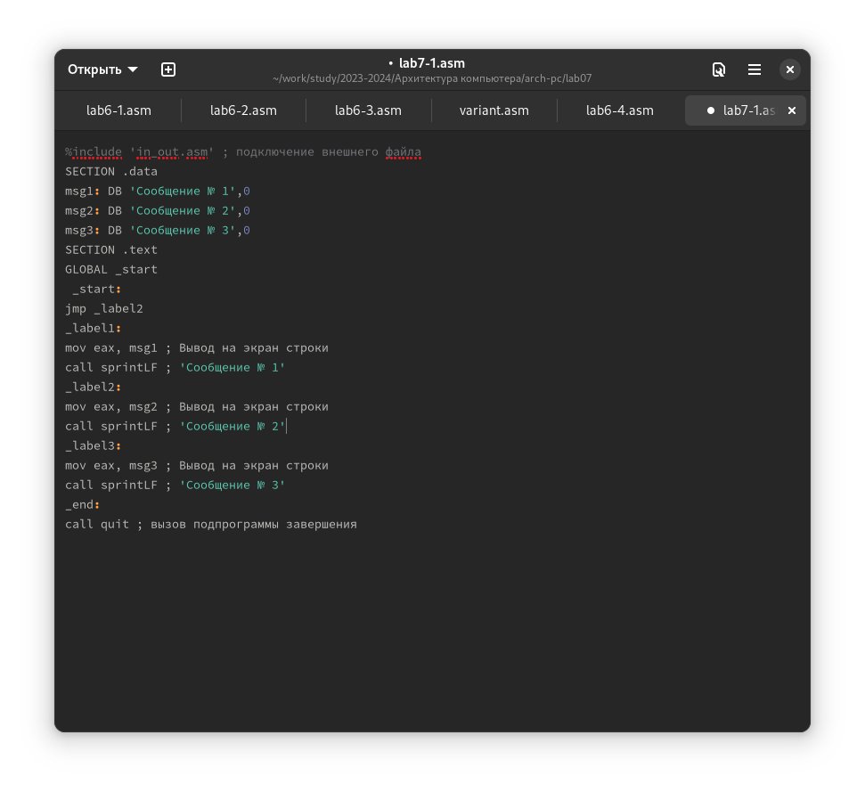{#fig:001 width=70%}

Создаю исполняемый файл и запускаю его.(рис. @fig:002)

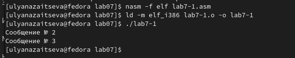{#fig:002 width=70%}

Использование инструкции jmp _label2 изменяет порядок исполнения инструкций и позволяет выполнить инструкции начиная с _label2, пропустив вывод первого сообщения.

Меняю программу, чтобы она выводила сначала "Сообщение № 2", потом "Сообщение № 1’" и завершала работу. Изменяю текст программы в соответствии с листингом 7.2.(рис. @fig:003).

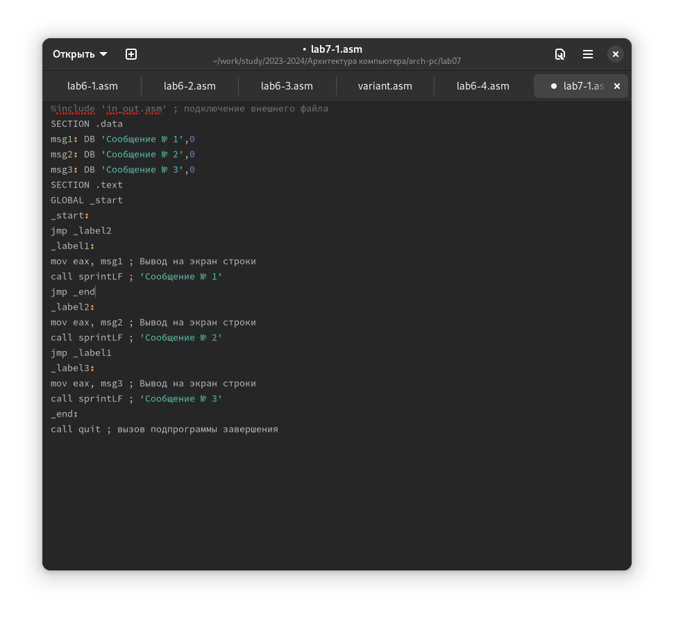{#fig:003 width=70%}

Создаю исполняемый файл и проверяю его работу.(рис. @fig:004)

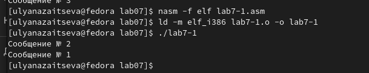{#fig:004 width=70%}

После меняю текст программы, добавив в начале программы jmp _label3, jmp _label2 в конце метки jmp _label3, jmp _label1 добавляю в конце метки jmp _label2, и добавляю jmp _end в конце метки jmp _label1, (рис. @fig:005).

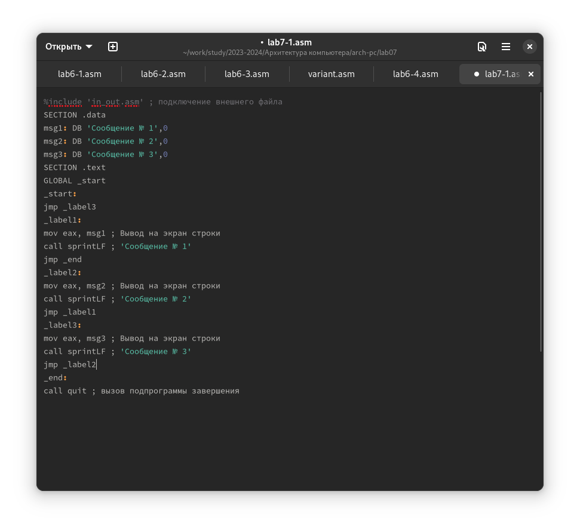{#fig:005 width=70%}

Создаю исполняемый файл и проверяю его работу.(рис. @fig:006)

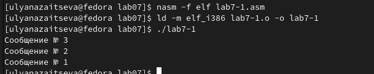{#fig:006 width=70%}

Создаю файл lab7-2.asm. Ввожу текст программы из листинга 7.3 (рис. @fig:007)

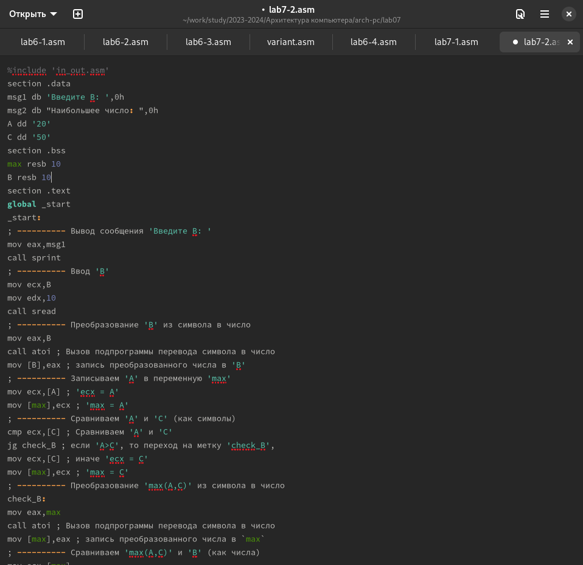{#fig:007 width=70%}

Создаю исполняемый файл и проверьте его работу. (рис. @fig:008)

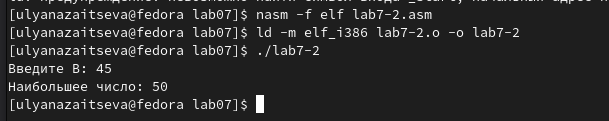{#fig:008 width=70%}

2. Изучение структуры файлы листинга.

Создаю файл листинга для программы из файла lab7-2.asm. Открываю файл листинга lab7-2.lst с помощью текстового редактора.(рис. @fig:009)

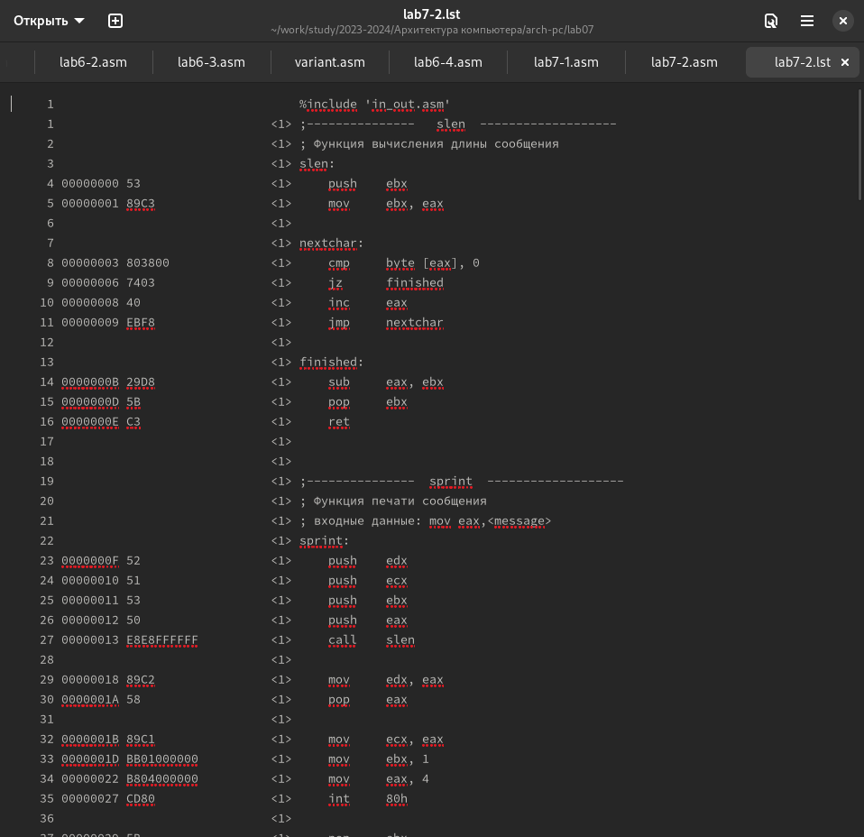{#fig:009 width=70%}

Рассмотрим 3 строки(рис. @fig:010)

{#fig:010 width=70%}

"; ---slen-----" - комментарий к коду с названием последующей функции

"; Функция вычисления длины сообщения" - комментарий к коду, не имеющий адреса и машинного кода.

"slen" - название функции, не имеет адреса и машинного кода.

Открываю файл с программой lab7-2.asm и в выбранной мной инструкции с двумя операндами удаляю выделенный операнд.(рис. @fig:011)

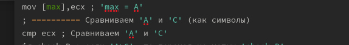{#fig:011 width=70%}

На выходе получаю ошибку.Инструкция mov не может работать, имея только один операнд.(рис. @fig:012)

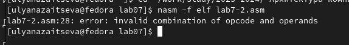{#fig:012 width=70%}

3. Задания для самостоятельной работы.

Пишу программу нахождения наименьшей из 3 целочисленных переменных a, b и c.  Мой вариант - 17, поэтому мои значения - 26, 12 и 68 (рис. @fig:013)

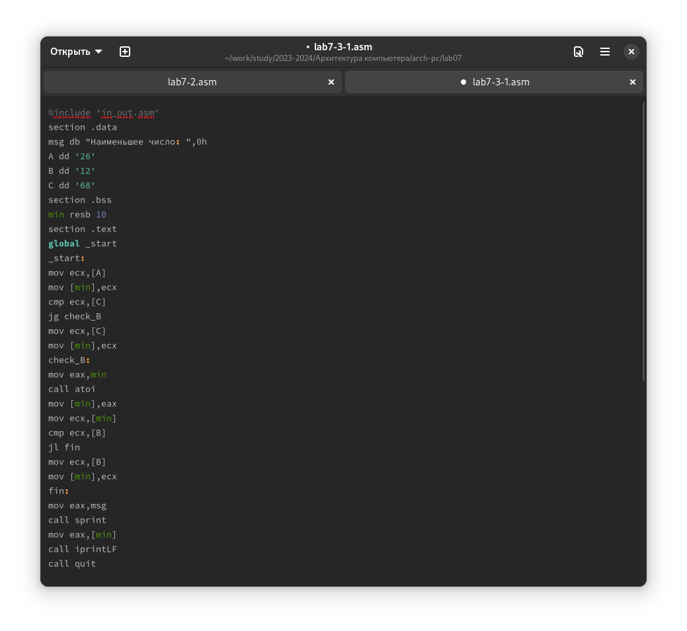{#fig:013 width=70%}

%include 'in_out.asm'
section .data
msg db "Наименьшее число: ",0h
A dd 26
B dd 12
C dd 68
section .bss
min resb 10
section .text
global _start
_start:
mov ecx,[A]
mov [min],ecx
cmp ecx,[C]
jl check_B
mov ecx,[C]
mov [min],ecx
check_B:
mov ecx,[min]
cmp ecx,[B]
jl fin
mov ecx,[B]
mov [min],ecx
fin:
mov eax,msg
call sprint
mov eax,[min]
call iprintLF
call quit

Проверяю его работу(рис. @fig:014)

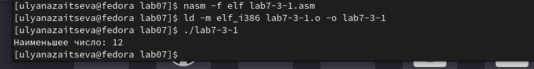{#fig:014 width=70%}

Программа работает исправно!

Пишу программу, которая для введенных с клавиатуры значений х и а вычисляет значение и выводит результат вычислений заданной для моего варианта функции f(x):

а + 8, если а < 8

а*х, если а >= 8

(рис. @fig:015).

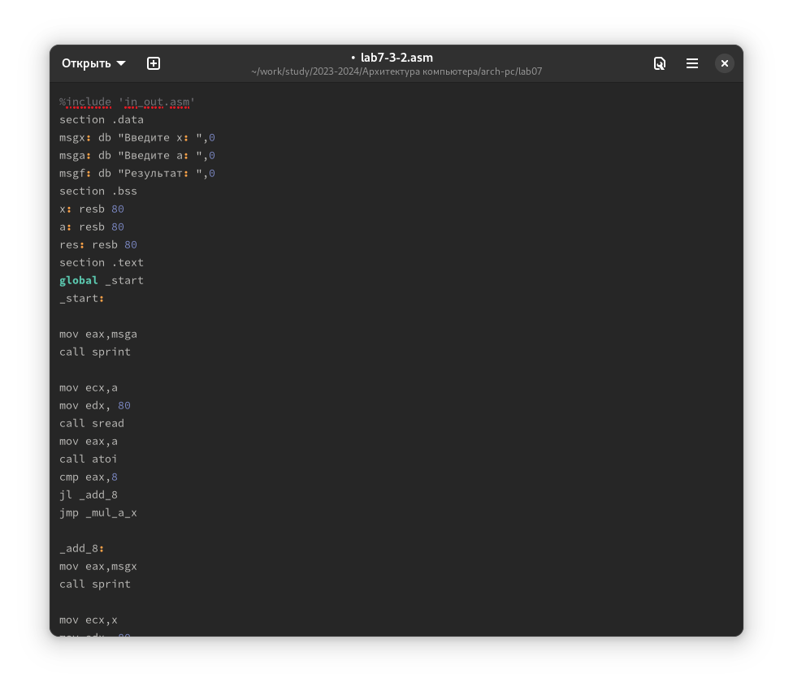{#fig:015 width=70%}

%include 'in_out.asm'
section .data
msgx: db "Введите x: ",0
msga: db "Введите a: ",0
msgf: db "Результат: ",0
section .bss
x: resb 80
a: resb 80
res: resb 80
section .text
global _start
_start:

mov eax,msga
call sprint

mov ecx,a
mov edx, 80
call sread
mov eax,a
call atoi
cmp eax,8
jl _add_8
jmp _mul_a_x

_add_8:
mov eax,msgx
call sprint

mov ecx,x
mov edx, 80
call sread
mov eax,x
call atoi

add eax, 8
jmp _end

_mul_a_x:
mov edx, a
mov eax, x
mul edx

_end:
mov ecx, eax
mov eax, msgf
call sprint
mov eax, ecx
call iprintLF
call quit

Проверяю его работу(рис. @fig:016)

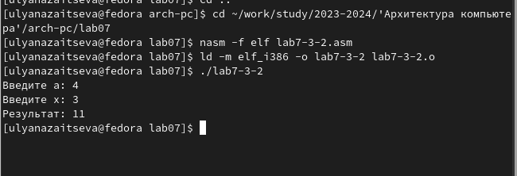{#fig:016 width=70%}

Ответ верный.

# Выводы

Во время выполнения лабораторной работы я изучила команды условного и безусловного переходов, приобрела навыки написания программ с использованием переходов, познакомилась с назначением и структурой файла
листинга.

