---
## Front matter
title: "Отчёт по лабораторной работе №9"
subtitle: "Дисциплина: Архитектура компьютера"
author: "Зайцева Ульяна Владимировна"

## Generic otions
lang: ru-RU
toc-title: "Содержание"

## Bibliography
bibliography: bib/cite.bib
csl: pandoc/csl/gost-r-7-0-5-2008-numeric.csl

## Pdf output format
toc: true # Table of contents
toc-depth: 2
lof: true # List of figures
lot: true # List of tables
fontsize: 12pt
linestretch: 1.5
papersize: a4
documentclass: scrreprt
## I18n polyglossia
polyglossia-lang:
  name: russian
  options:
	- spelling=modern
	- babelshorthands=true
polyglossia-otherlangs:
  name: english
## I18n babel
babel-lang: russian
babel-otherlangs: english
## Fonts
mainfont: PT Serif
romanfont: PT Serif
sansfont: PT Sans
monofont: PT Mono
mainfontoptions: Ligatures=TeX
romanfontoptions: Ligatures=TeX
sansfontoptions: Ligatures=TeX,Scale=MatchLowercase
monofontoptions: Scale=MatchLowercase,Scale=0.9
## Biblatex
biblatex: true
biblio-style: "gost-numeric"
biblatexoptions:
  - parentracker=true
  - backend=biber
  - hyperref=auto
  - language=auto
  - autolang=other*
  - citestyle=gost-numeric
## Pandoc-crossref LaTeX customization
figureTitle: "Рис."
tableTitle: "Таблица"
listingTitle: "Листинг"
lofTitle: "Список иллюстраций"
lotTitle: "Список таблиц"
lolTitle: "Листинги"
## Misc options
indent: true
header-includes:
  - \usepackage{indentfirst}
  - \usepackage{float} # keep figures where there are in the text
  - \floatplacement{figure}{H} # keep figures where there are in the text
---

# Цель работы

Приобретение навыков написания программ с использованием подпрограмм. Знакомство
с методами отладки при помощи GDB и его основными возможностями.

# Задание
1. Реализация подпрограмм в NASM.
2. Отладка программам с помощью GDB.
3. Добавление точек останова.
4. Работа с данными программы в GDB.
5. Обработка аргументов командной строки в GDB.
6. Задания для самостоятельной работы.

# Теоретическое введение

Отладка — это процесс поиска и исправления ошибок в программе. 
В общем случае его можно разделить на четыре этапа:
• обнаружение ошибки;
• поиск её местонахождения;
• определение причины ошибки;
• исправление ошибки.

Наиболее часто применяют следующие методы отладки:
• создание точек контроля значений на входе и выходе участка программы (например,
вывод промежуточных значений на экран — так называемые диагностические сообще-
ния);
• использование специальных программ-отладчиков.
Отладчики позволяют управлять ходом выполнения программы, контролировать и из-
менять данные. Это помогает быстрее найти место ошибки в программе и ускорить её
исправление. Наиболее популярные способы работы с отладчиком — это использование
точек останова и выполнение программы по шагам.
Пошаговое выполнение — это выполнение программы с остановкой после каждой строчки,
чтобы программист мог проверить значения переменных и выполнить другие действия.
Точки останова — это специально отмеченные места в программе, в которых программа-
отладчик приостанавливает выполнение программы и ждёт команд. Наиболее популярные
виды точек останова:
• Breakpoint — точка останова (остановка происходит, когда выполнение доходит до
определённой строки, адреса или процедуры, отмеченной программистом);
• Watchpoint — точка просмотра (выполнение программы приостанавливается, если
программа обратилась к определённой переменной: либо считала её значение, либо
изменила его)

GDB (GNU Debugger — отладчик проекта GNU) [1] работает на многих UNIX-подобных
системах и умеет производить отладку многих языков программирования. GDB предлагает
обширные средства для слежения и контроля за выполнением компьютерных программ. От-
ладчик не содержит собственного графического пользовательского интерфейса и использует
стандартный текстовый интерфейс консоли. Однако для GDB существует несколько сторон-
них графических надстроек, а кроме того, некоторые интегрированные среды разработки
используют его в качестве базовой подсистемы отладки.
Отладчик GDB (как и любой другой отладчик) позволяет увидеть, что происходит «внутри»
программы в момент её выполнения или что делает программа в момент сбоя.
GDB может выполнять следующие действия:
• начать выполнение программы, задав всё, что может повлиять на её поведение;
• остановить программу при указанных условиях;
• исследовать, что случилось, когда программа остановилась;
• изменить программу так, чтобы можно было поэкспериментировать с устранением
эффектов одной ошибки и продолжить выявление других

Подпрограмма — это, как правило, функционально законченный участок кода, который
можно многократно вызывать из разных мест программы. В отличие от простых переходов
из подпрограмм существует возврат на команду, следующую за вызовом.

# Выполнение лабораторной работы

1. Реализация подпрограмм в NASM.

Создаю каталог для выполнения лабораторной работы №9, перейдите в него и создаю файл lab9-1.asm(рис. @fig:001).

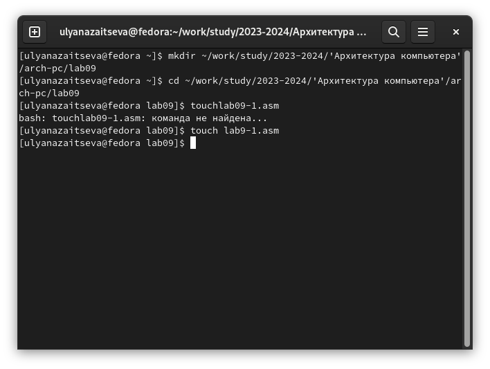{#fig:001 width=70%}

Ввожу в файл lab9-1.asm текст программы с использованием подпрограммы из листинга 9.1. (рис. @fig:002)

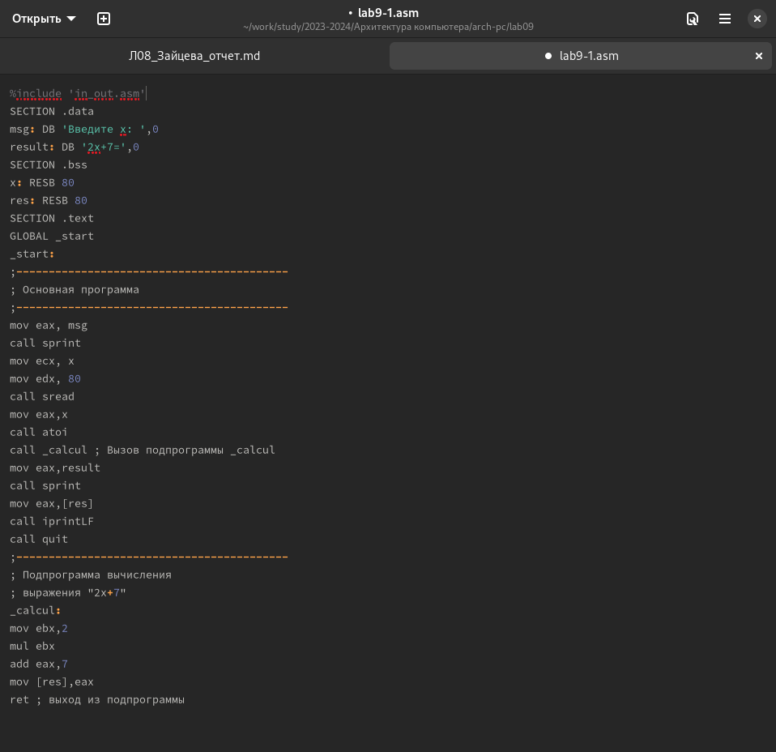{#fig:002 width=70%}

Создаю исполняемый файл и проверяю его работу(рис. @fig:003)

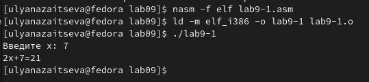{#fig:003 width=70%}

Изменяю текст программы, добавив подпрограмму _subcalcul в подпрограмму _calcul для вычисления выражения f(g(x)), где x вводится с клавиатуры, f(x) = 2x + 7, g(x) = 3x − 1. (рис. @fig:004)

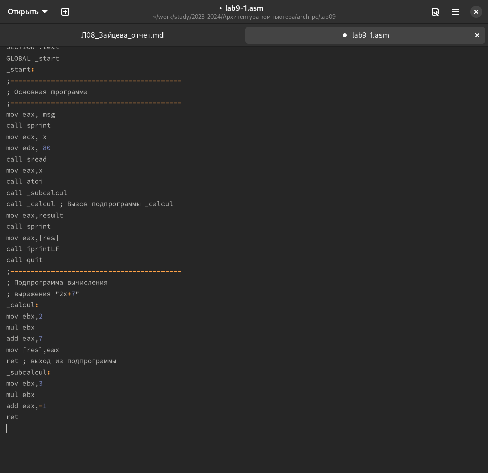{#fig:004 width=70%}

Создаю файл и проверяю его работу(рис. @fig:005)

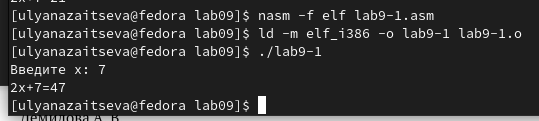{#fig:005 width=70%}

2. Отладка программам с помощью GDB.

Создаю файл lab9-2.asm с текстом программы из Листинга 9.2. (рис. @fig:006)

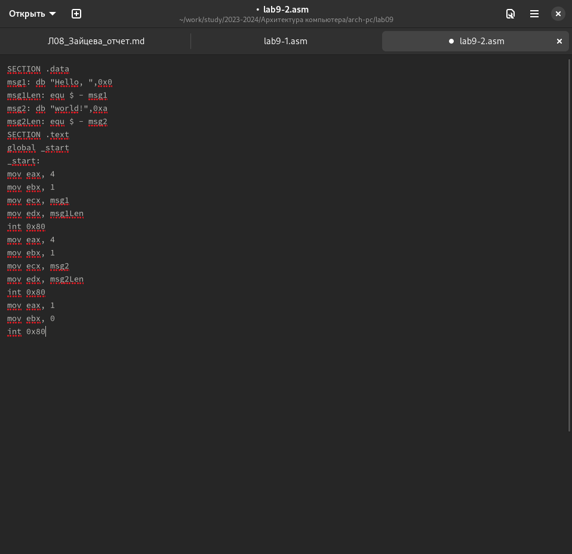{#fig:006 width=70%}

Получаю исполняемый файл для работы с GDB с ключом ‘-g’.(рис. @fig:007)

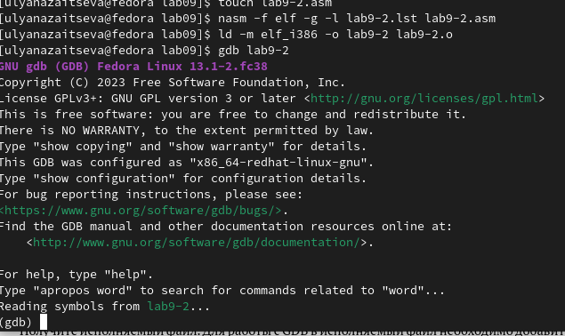{#fig:007 width=70%}

Проверяю работу программы, запустив ее в gdb с помощью команды run(рис. @fig:008)

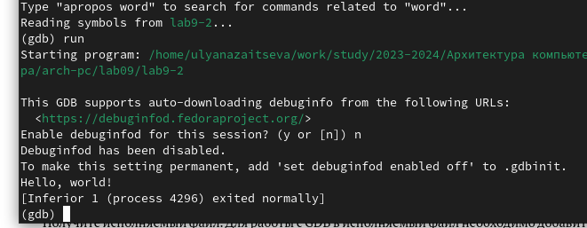{#fig:008 width=70%}

Для более подробного анализа программы устанавливаю брейкпоинт на метку _start и запускаю её(рис. @fig:009)

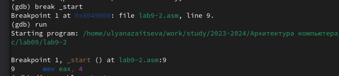{#fig:009 width=70%}

Просматриваем дисассимилированный код программы с помощью команды disassemble, начиная с метки _start, и переключаемся на отображение команд с синтаксисом Intel, введя команду set disassembly-flavor intel(рис. @fig:010)

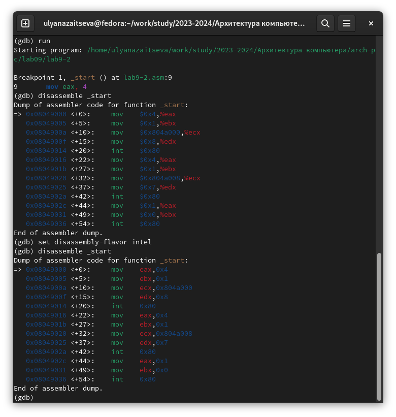{#fig:010 width=70%}

Включаю режим псевдографики для более удобного анализа программы с помощью команд layout asm и layout regs(забыла сделать скрин((()

3. Добавление точек останова.

Проверяю, что точка останова по имени метки _start установлена с помощью команды i b  и устанавливаю еще одну точку останова. Просматриваю информацию о всех установленных точках останова.(рис. @fig:011)

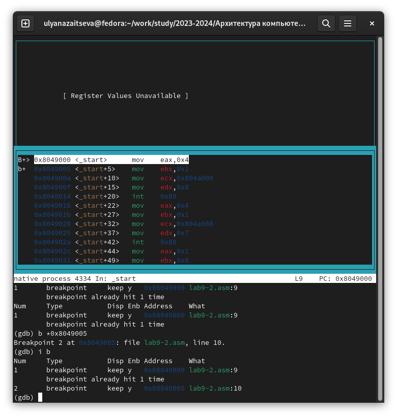{#fig:011 width=70%}

4. Работа с данными программы в GDB.

Выполняю инструкции с помощью команды stepi(si) и слежу за изменением значений регистров. (рис. @fig:012)(рис. @fig:013)

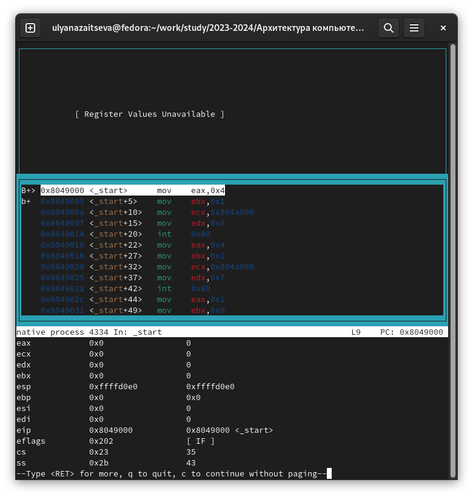{#fig:012 width=70%}

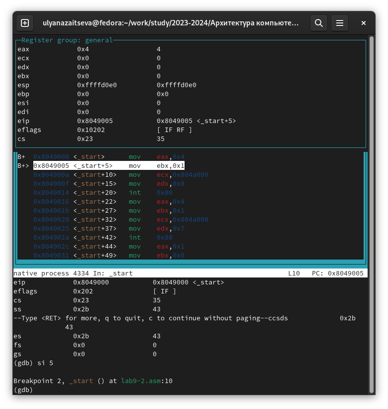{#fig:013 width=70%}

Изменились значения регистров eax, ecx, edx и ebx.

Просматриваю значение переменной msg1 по имени с помощью команды x/1sb &msg1 и значение переменной msg2 по ее адресу. С помощью команды set изменяю первый символ переменной msg1 и заменяю первый символ в переменной msg2 на b.(рис. @fig:015)

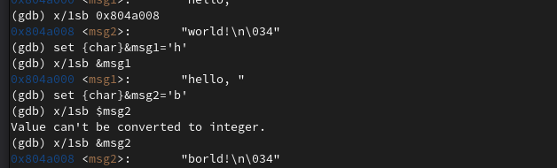{#fig:015 width=70%}

Вывожу в шестнадцатеричном формате, в двоичном формате и в символьном виде соответственно значение регистра edx с помощью команды print p/F $val.(рис. @fig:016)

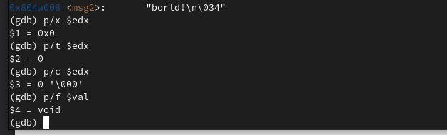{#fig:016 width=70%}

С помощью команды set изменяю значение регистра ebx (рис. @fig:017)

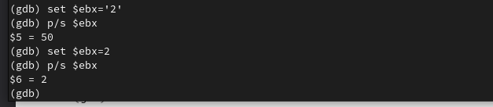{#fig:017 width=70%}

Разница вывода команд p/s $ebx состоит в том, что в первом случае мы переводим символ в его строковый вид, а во втором случае число в строковом виде не изменяется.

Выхожу из gdb с помощью команды quit. (рис. @fig:018)

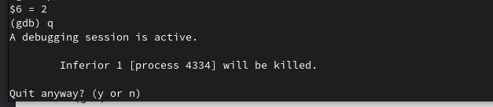{#fig:018 width=70%} 

5. Обработка аргументов командной строки в GDB.

Копирую файл lab8-2.asm с программой из листинга 8.2 в файл lab9-3.asm и создаю исполняемый файл.Загружаю исполняемый файл в отладчик gdb, указывая необходимые аргументы с использованием ключа --args.(рис. @fig:019)

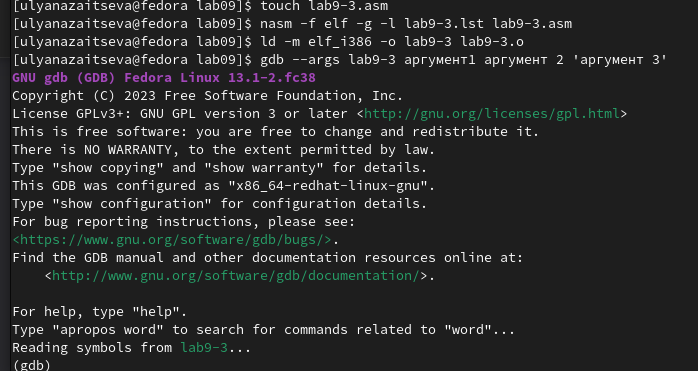{#fig:019 width=70%} 

Устанавливаю точку останова перед первой инструкцией в программе и запускаю ее.(рис. @fig:020)

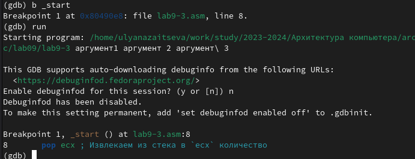{#fig:020 width=70%} 

Посматриваю позиции стека по их адресам.(рис. @fig:021)

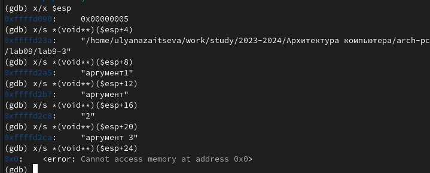{#fig:021 width=70%}

Шаг изменения адреса равен 4, т.к количество аргументов командной строки равно 4.

6. Задания для самостоятельной работы.

1) Преобразовываю программу из лабораторной работы №8 (Задание №1 для самостоятельной работы), реализовав вычисление значения функции f(x) как подпрограмму. в новом файле lab9-4.asm(рис. @fig:022)

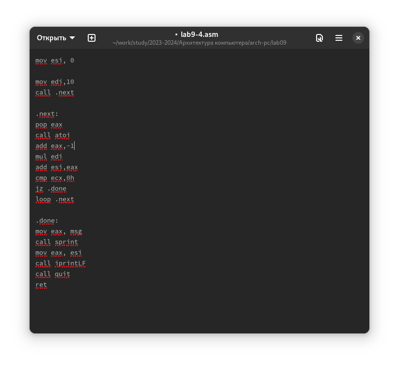{#fig:022 width=70%}

Проверяю, что она работает корректно.(рис. @fig:023)

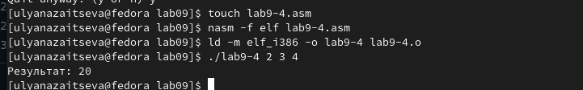{#fig:023 width=70%}

Код:
; 10(x-1)
%include 'in_out.asm'
SECTION .data
msg db "Результат: ",0
SECTION .text
global _start

_start:
pop ecx
pop edx
sub ecx,1
mov esi, 0
mov edi,10
call .next

.next:
pop eax
call atoi
add eax,-1
mul edi
add esi,eax
cmp ecx,0h
jz .done
loop .next

.done:
mov eax, msg
call sprint
mov eax, esi
call iprintLF
call quit
ret

2) Ввожу в файл lab9-5.asm текст программы из листинга 9.3.(рис. @fig:024)

{#fig:024 width=70%}

При правильной работе программа должна выводить 25. Создаю исполняемый файл и запускаю его.(рис. @fig:025)

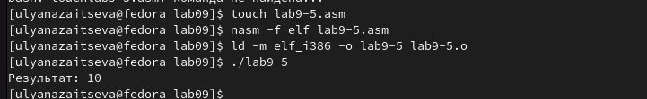{#fig:025 width=70%}

В выводе получаем неправильный ответ. Получаю исполняемый файл для работы с gdb, запускаю его и ставлю брейкпоинты для каждой инструкции, связанной с вычислениями. Прохожусь по каждому брейкпоинту и слежу за изменениями значений регистров.
При выполнении инструкции mul ecx происходит умножение ecx(4) на eаx(2), вместо умножения 4 на 5 (ebx). Это происходит потому что стоящая перед mov ecx,4 инструкция add ebx,eax не связана с mul ecx, но связана инструкция mov eax,2.(рис. @fig:026)

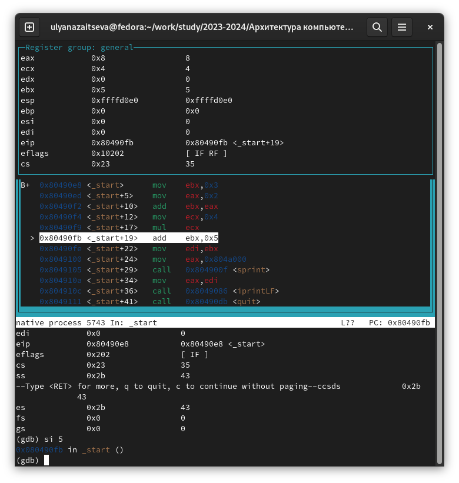{#fig:026 width=70%}

Исправляю ошибку, добавляя после add ebx,eax mov eax,ebx и заменяя ebx на eax в инструкциях add ebx,5 и mov edi,ebx. (рис. @fig:027)

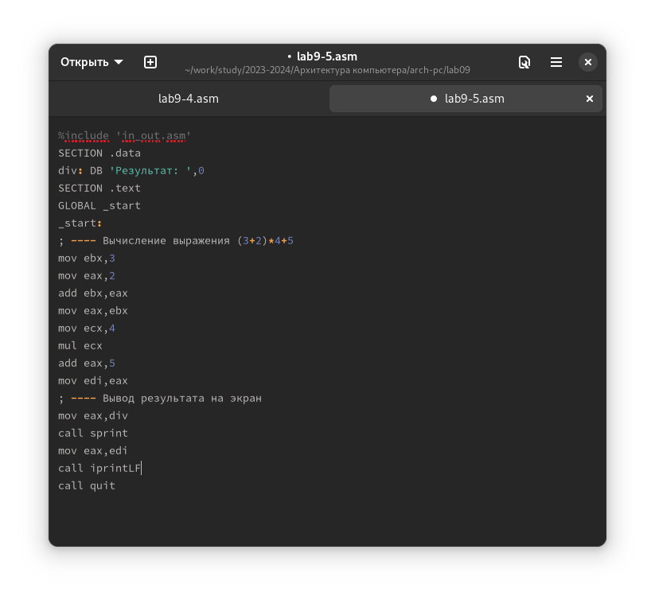{#fig:027 width=70%}

Запускаю код и проверяю, что программа работает корректно.(рис. @fig:028)

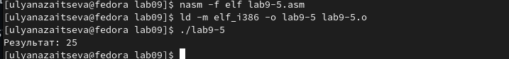{#fig:028 width=70%}

Код:

%include 'in_out.asm'
SECTION .data
div: DB 'Результат: ',0
SECTION .text
GLOBAL _start
_start:
; ---- Вычисление выражения (3+2)*4+5
mov ebx,3
mov eax,2
add ebx,eax
mov eax,ebx
mov ecx,4
mul ecx
add eax,5
mov edi,eax
; ---- Вывод результата на экран
mov eax,div
call sprint
mov eax,edi
call iprintLF
call quit

# Выводы

Во время выполнения данной лабораторной работы я приобрела навыки написания программ с использованием подпрограмм и познакомилась с методами отладки при помощи GDB и его основными возможностями.

