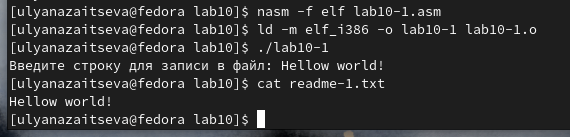
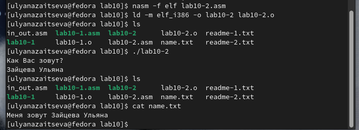

---
## Front matter
title: "Отчет по лабораторной работе №10"
subtitle: "Дисциплина: Архитектура компьютера"
author: "Зайцева Ульяна Владимировна"

## Generic otions
lang: ru-RU
toc-title: "Содержание"

## Bibliography
bibliography: bib/cite.bib
csl: pandoc/csl/gost-r-7-0-5-2008-numeric.csl

## Pdf output format
toc: true # Table of contents
toc-depth: 2
lof: true # List of figures
lot: true # List of tables
fontsize: 12pt
linestretch: 1.5
papersize: a4
documentclass: scrreprt
## I18n polyglossia
polyglossia-lang:
  name: russian
  options:
	- spelling=modern
	- babelshorthands=true
polyglossia-otherlangs:
  name: english
## I18n babel
babel-lang: russian
babel-otherlangs: english
## Fonts
mainfont: PT Serif
romanfont: PT Serif
sansfont: PT Sans
monofont: PT Mono
mainfontoptions: Ligatures=TeX
romanfontoptions: Ligatures=TeX
sansfontoptions: Ligatures=TeX,Scale=MatchLowercase
monofontoptions: Scale=MatchLowercase,Scale=0.9
## Biblatex
biblatex: true
biblio-style: "gost-numeric"
biblatexoptions:
  - parentracker=true
  - backend=biber
  - hyperref=auto
  - language=auto
  - autolang=other*
  - citestyle=gost-numeric
## Pandoc-crossref LaTeX customization
figureTitle: "Рис."
tableTitle: "Таблица"
listingTitle: "Листинг"
lofTitle: "Список иллюстраций"
lotTitle: "Список таблиц"
lolTitle: "Листинги"
## Misc options
indent: true
header-includes:
  - \usepackage{indentfirst}
  - \usepackage{float} # keep figures where there are in the text
  - \floatplacement{figure}{H} # keep figures where there are in the text
---

# Цель работы

Приобретение навыков написания программ для работы с файлами

# Задание

1. Написание программ для работы с файлами.

2. Задание для самостоятельной работы.

# Теоретическое введение

ОС GNU/Linux является многопользовательской операционной системой. И для обеспечения защиты данных одного пользователя от действий других пользователей существуют
специальные механизмы разграничения доступа к файлам. Кроме ограничения доступа, данный механизм позволяет разрешить другим пользователям доступ данным для совместной
работы.
Права доступа определяют набор действий (чтение, запись, выполнение), разрешённых
для выполнения пользователям системы над файлами. Для каждого файла пользователь
может входить в одну из трех групп: владелец, член группы владельца, все остальные. Для каждой из этих групп может быть установлен свой набор прав доступа. Владельцем файла
является его создатель. 

Набор прав доступа задается тройками битов и состоит из прав на чтение, запись и исполнение файла. В символьном представлении он имеет вид строк rwx, где вместо любого
символа может стоять дефис. Всего возможно 8 комбинаций, приведенных в таблице 10.1.
Буква означает наличие права (установлен в единицу второй бит триады r — чтение, первый бит w — запись, нулевой бит х — исполнение), а дефис означает отсутствие права (нулевое значение соответствующего бита). Также права доступа могут быть представлены как восьмеричное число. Так, права доступа rw- (чтение и запись, без исполнения) понимаются как три двоичные цифры 110 или как восьмеричная цифра 6.

Свойства (атрибуты) файлов и каталогов можно вывести на терминал с помощью команды
ls с ключом -l. 

Обработка файлов в операционной системе Linux осуществляется за счет использования
определенных системных вызовов. Для корректной работы и доступа к файлу при его открытии или создании, файлу присваивается уникальный номер (16-битное целое число) –
дескриптор файла

Для записи в файл служит системный вызов sys_write, который использует следующие
аргументы: количество байтов для записи в регистре EDX, строку содержимого для записи
ECX, файловый дескриптор в EBX и номер системного вызова sys_write (4) в EAX

Для чтения данных из файла служит системный вызов sys_read, который использует
следующие аргументы: количество байтов для чтения в регистре EDX, адрес в памяти для
записи прочитанных данных в ECX, файловый дескриптор в EBX и номер системного вызова
sys_read (3) в EAX. 

Для изменения содержимого файла служит системный вызов sys_lseek, который исполь-
зует следующие аргументы: исходная позиция для смещения EDX, значение смещения в
байтах в ECX, файловый дескриптор в EBX и номер системного вызова sys_lseek (19) в EAX.

Удаление файла осуществляется системным вызовом sys_unlink, который использует
один аргумент – имя файла в регистре EBX.

# Выполнение лабораторной работы

1. Написание программ для работы с файлами.

Создаю каталог для программ лабораторной работы №10, перехожу в него и
создаю файлы lab10-1.asm, readme-1.txt и readme-2.txt.(рис. @fig:001)

{#fig:001 width=70%}

Ввожу в файл lab10-1.asm текст программы из листинга 10.1(рис. @fig:002)

{#fig:002 width=70%}

Создаю исполняемый файл и проверяю его работу(рис. @fig:003)

{#fig:003 width=70%}

С помощью команды chmod изменяю права доступа к файлу lab10-1.asm с исходным
текстом программы, добавив права на исполнение.(рис. @fig:004)

{#fig:004 width=70%}

Файл не выполняется, потому что в команде я указала себя владельцем - 'u', '-' - отменить набор прав, 'х' - право на исполнение.

С помощью команды chmod u+х меняю права доступа к файлу lab10-1.asm с исходным текстом программы, добавив права на исполнение, и пробую выполнить его.(рис. @fig:005)

{#fig:005 width=70%}

Файл начинает исполнение, но не исполняется, потому что не имеет в себе команд для терминала.

Мой вариант - 17. Предоставляю права доступа к файлу readme-1.txt представленные в символьном виде, а для файла readme-2.txt – в двочном виде в соответсвии с таблицей 10.4.(рис. @fig:006)

{#fig:006 width=70%}

2. Задание для самостоятельной работы.

Создаю файл lab10-2.asm

Пишу программу работающую по следующему алгоритму:
• Вывод приглашения “Как Вас зовут?”
• ввести с клавиатуры свои фамилию и имя
• создать файл с именем name.txt
• записать в файл сообщение “Меня зовут”
• дописать в файл строку введенную с клавиатуры
• закрыть файл(рис. @fig:007)

{#fig:007 width=70%}

Создаю исполняемый файл и проверяю его работу. Проверяю наличие файла и его
содержимое с помощью команд ls и cat(рис. @fig:008)

{#fig:008 width=70%}

Код:

%include 'in_out.asm'
SECTION .data
msg1 db 'Как Вас зовут?', 0h
filename db 'name.txt', 0h
msg2 db 'Меня зовут ', 0h
SECTION .bss
name resb 255
SECTION .text
global _start

_start:
mov eax,msg1
call sprintLF
mov ecx, name
mov edx, 255
call sread

mov ecx, 0777o
mov ebx, filename
mov eax, 8
int 80h

mov ecx, 2
mov ebx, filename
mov eax, 5
int 80h

mov esi, eax

mov eax, msg2
call slen

mov edx, eax
mov ecx, msg2
mov ebx, esi
mov eax, 4
int 80h

mov eax, name
call slen

mov edx, eax
mov ecx, name
mov ebx, esi
mov eax, 4
int 80h

mov ebx, esi
mov eax, 6
int 80h
call quit

# Выводы

В ходе выполнения этой лабораторной работы я приобрела навыки написания программ для работы с файлами

